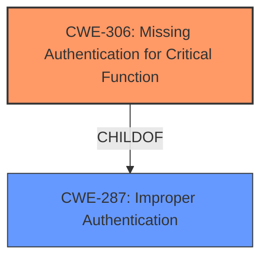

# Analysis for CVE-2022-47700

# Summary

| CWE ID | CWE Name | Confidence | CWE Abstraction Level | CWE Vulnerability Mapping Label | CWE-Vulnerability Mapping Notes |
|---|---|---|---|---|---|
| **CWE-306** | **Missing Authentication for Critical Function** | 0.9 | Base | Primary | Allowed |
| CWE-287 | Improper Authentication | 0.6 | Class | Secondary | Discouraged |

## Evidence and Confidence

*   **Confidence Score:** 0.9
*   **Evidence Strength:** HIGH

## Relationship Analysis

The primary CWE is CWE-306, which falls under the broader Class CWE-287. CWE-306 is more specific, indicating a complete lack of authentication for critical functions, aligning directly with the vulnerability description. The relationships influenced the decision by favoring the more precise Base CWE over the general Class CWE.

## Vulnerability Chain

The vulnerability chain consists of the **missing authentication**, leading to unauthorized access and ultimately information disclosure and potential full router control.

## Summary of Analysis

The initial assessment pointed towards **improper authentication**, but further analysis, especially considering the "CVE Reference Links Content Summary," clarified that authentication was entirely missing for certain functionalities.

Evidence:
- Vulnerability Description Key Phrases: "**rootcause:** **Improper authentication**"
- CVE Reference Links Content Summary: "The root cause is the **lack of proper authentication** checks on the COMFAST CF-WR623N router. An unauthenticated user can access router configuration information, including sensitive data."
- Vulnerability Description: "**Improper authentication** allows requests to be made to back-end scripts without a valid session or authentication."

The graph relationships reinforced the choice of CWE-306 as it is a child of CWE-287, representing a specific instance of **improper authentication** where authentication is completely missing. The chosen CWE is at the optimal level of specificity because it precisely describes the root cause: the absence of authentication for critical functions, enabling attackers to bypass security measures entirely.

Relevant CWE Information:

# Enhanced Context (25 CWEs)
The following CWEs were identified as potentially relevant to this vulnerability:

## CWE-807: Reliance on Untrusted Inputs in a Security Decision
**Abstraction Level**: Base
**Similarity Score**: 0.77

## CWE-303: Incorrect Implementation of Authentication Algorithm
**Abstraction Level**: Base
**Similarity Score**: 0.76

## CWE-280: Improper Handling of Insufficient Permissions or Privileges 
**Abstraction Level**: Base
**Similarity Score**: 0.76

## CWE-74: Improper Neutralization of Special Elements in Output Used by a Downstream Component ('Injection')
**Abstraction Level**: Class
**Similarity Score**: 0.76

## CWE-1220: Insufficient Granularity of Access Control
**Abstraction Level**: Base
**Similarity Score**: 0.76

## CWE-274: Improper Handling of Insufficient Privileges
**Abstraction Level**: Base
**Similarity Score**: 0.75

## CWE-1391: Use of Weak Credentials
**Abstraction Level**: Class
**Similarity Score**: 0.75

## CWE-799: Improper Control of Interaction Frequency
**Abstraction Level**: Class
**Similarity Score**: 0.75

## CWE-472: External Control of Assumed-Immutable Web Parameter
**Abstraction Level**: Base
**Similarity Score**: 0.75

## CWE-41: Improper Resolution of Path Equivalence
**Abstraction Level**: Base
**Similarity Score**: 0.75

## CWE-259: Use of Hard-coded Password
**Abstraction Level**: Variant
**Similarity Score**: 6940.19

## CWE-798: Use of Hard-coded Credentials
**Abstraction Level**: Base
**Similarity Score**: 6902.95

## CWE-287: Improper Authentication
**Abstraction Level**: Class
**Similarity Score**: 6658.68

## CWE-1390: Weak Authentication
**Abstraction Level**: Class
**Similarity Score**: 6646.85

## CWE-863: Incorrect Authorization
**Abstraction Level**: Class
**Similarity Score**: 6551.58

## CWE-78: Improper Neutralization of Special Elements used in an OS Command ('OS Command Injection')
**Abstraction Level**: base
**Similarity Score**: 4.59

## CWE-471: Modification of Assumed-Immutable Data (MAID)
**Abstraction Level**: base
**Similarity Score**: 4.33

## CWE-94: Improper Control of Generation of Code ('Code Injection')
**Abstraction Level**: base
**Similarity Score**: 4.33

## CWE-321: Use of Hard-coded Cryptographic Key
**Abstraction Level**: variant
**Similarity Score**: 4.01

## CWE-259: Use of Hard-coded Password
**Abstraction Level**: variant
**Similarity Score**: 4.01

## CWE-98: Improper Control of Filename for Include/Require Statement in PHP Program ('PHP Remote File Inclusion')
**Abstraction Level**: variant
**Similarity Score**: 3.89

## CWE-426: Untrusted Search Path
**Abstraction Level**: base
**Similarity Score**: 3.64

## CWE-88: Improper Neutralization of Argument Delimiters in a Command ('Argument Injection')
**Abstraction Level**: base
**Similarity Score**: 3.64

## CWE-257: Storing Passwords in a Recoverable Format
**Abstraction Level**: base
**Similarity Score**: 3.64

## CWE-425: Direct Request ('Forced Browsing')
**Abstraction Level**: Base
**Similarity Score**: 2.90

## Technical Explanation for CWE-306: Missing Authentication for Critical Function
- **Match with Vulnerability Details:** The vulnerability description clearly states that requests can be made to back-end scripts without a valid session or authentication. This directly corresponds to the definition of CWE-306, where critical functions lack any authentication mechanism.
- **Security Implications and Potential Impact:** The absence of authentication allows attackers to bypass security controls, leading to unauthorized access to sensitive information (like admin credentials and Wi-Fi PSK) and potentially full control of the router.
- **Parent-Child Relationships:** CWE-306 is a child of CWE-287 (Improper Authentication), indicating a specific case where authentication is completely missing rather than merely weak or flawed.
- **MITRE Mapping Guidance:** The usage is ALLOWED, which says the CWE is a preferred level of abstraction for mapping to the root causes of vulnerabilities.
## Technical Explanation for CWE-287: Improper Authentication
- **Match with Vulnerability Details:** The initial description points to **improper authentication**, which is a broader category.
- **Security Implications and Potential Impact:** **Improper authentication** can lead to unauthorized access and potentially full control of the router.
- **Parent-Child Relationships:** This CWE is a class, and contains child CWEs that are more specific.

## CWEs Considered But Not Used:

- **CWE-425: Direct Request ('Forced Browsing')**: While direct requests are possible due to the missing authentication, the root cause isn't the improper enforcement of authorization on URLs, but rather the complete lack of authentication in the first place. Therefore, CWE-425 is a consequence rather than the root cause.
- **CWE-798: Use of Hard-coded Credentials, CWE-259: Use of Hard-coded Password**: There is no evidence provided to support that hardcoded credentials is the case, but rather a complete lack of authentication.
- **CWE-1390: Weak Authentication:** While the term "**improper authentication**" is used, it does not apply. Authentication is not weak, it is **missing**.
- **CWE-285: Improper Authorization**: Authorization comes after authentication. If the product does not authenticate, then authorization is not reached.