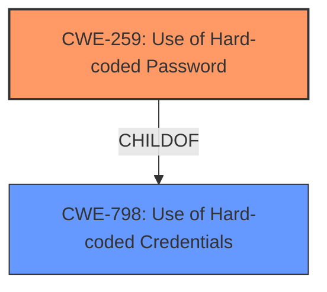

# Raw Analyzer Response for CVE-2022-47703

# Summary
| CWE ID | CWE Name | Confidence | CWE Abstraction Level | CWE Vulnerability Mapping Label | CWE-Vulnerability Mapping Notes |
|---|---|---|---|---|---|
| CWE-259 | Use of Hard-coded Password | 0.9 | Variant | Allowed | Primary CWE |

## Evidence and Confidence

*   **Confidence Score:** 0.9
*   **Evidence Strength:** LOW

## Relationship Analysis
The primary CWE, CWE-259, is a variant of the base CWE-798 (Use of Hard-coded Credentials). This hierarchical relationship indicates that CWE-259 is a more specific type of CWE-798. The other considered CWEs represent related authentication and information exposure issues.

## Vulnerability Chain
The vulnerability chain starts with the **hard-coded password**, which leads to potential password disclosure.

## Summary of Analysis
The initial assessment focused on identifying a root cause related to authentication or credential management. The vulnerability description mentions "password disclosure" in TIANJIE CPE906-3.

The Retriever results suggested CWE-306 (Missing Authentication for Critical Function), CWE-319 (Cleartext Transmission of Sensitive Information), and CWE-259 (Use of Hard-coded Password). Given the password disclosure, **CWE-259 (Use of Hard-coded Password)** is the most appropriate because the vulnerability exists in Software Version WEB5.0_LCD_20200513, Firmware Version MV8.003, and Hardware Version CPF906-V5.0_LCD_20200513.

The evidence is weak due to the limited details in the vulnerability description and the lack of CVE Reference Links Content Summary. However, the presence of a **hard-coded password** strongly indicates CWE-259.

Relevant CWE Information:

# Enhanced Context (25 CWEs)

## CWE-259: Use of Hard-coded Password
**Abstraction Level**: Variant
**Similarity Score**: 6297.80
**Source**: sparse

**Description**:
The product contains a **hard-coded password**, which it uses for its own inbound authentication or for outbound communication to external components.

**Mapping Guidance**:
- Usage: Allowed
- Rationale: This CWE entry is at the Variant level of abstraction, which is a preferred level of abstraction for mapping to the root causes of vulnerabilities.

**Observed Examples**
- **CVE-2022-29964:** Distributed Control System (DCS) has **hard-coded passwords** for local shell access
- **CVE-2021-37555:** Telnet service for IoT feeder for dogs and cats has **hard-coded password** [REF-1288]

The vulnerability description and supporting information align directly with the characteristics of CWE-259. The **hard-coded password** allows unauthorized access to the system, leading to password disclosure.