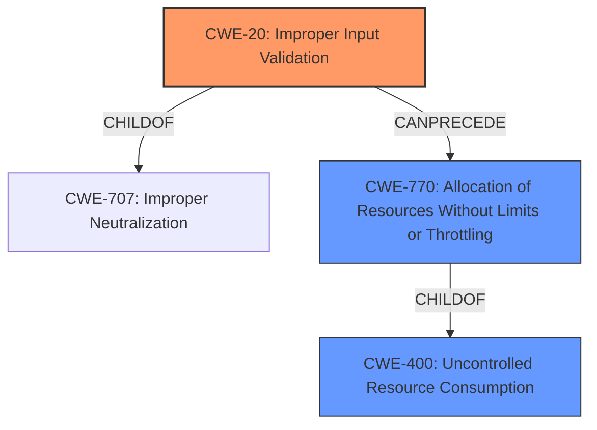

# Raw Analyzer Response for CVE-2022-47917

# Summary
| CWE ID | CWE Name | Confidence | CWE Abstraction Level | CWE Vulnerability Mapping Label | CWE-Vulnerability Mapping Notes |
|---|---|---|---|---|---|
| CWE-20 | Improper Input Validation | 0.9 | Class | Primary | Allowed-with-Review |
| CWE-400 | Uncontrolled Resource Consumption | 0.6 | Class | Secondary | Allowed |

## Evidence and Confidence

*   **Confidence Score:** 0.9
*   **Evidence Strength:** HIGH

## Relationship Analysis
The primary CWE is CWE-20, which is a class-level CWE. While there are more specific CWEs related to input validation, the provided information is not specific enough to determine the exact nature of the **improper input validation**. CWE-20 is a child of CWE-707 (Improper Neutralization) and has peer relationships with CWE-345 (Insufficient Verification of Data Authenticity). It can precede CWE-22 (Improper Limitation of a Pathname to a Restricted Directory ('Path Traversal')), CWE-41 (Improper Resolution of Path Equivalence), CWE-74 (Improper Neutralization of Special Elements in Output Used by a Downstream Component ('Injection')), and CWE-770 (Allocation of Resources Without Limits or Throttling).

CWE-770 is related in that **improper input validation** could lead to a state where resources are allocated without limits, causing a denial-of-service. It is a child of CWE-400 (Uncontrolled Resource Consumption), which is more general.

## Vulnerability Chain
The chain of events is as follows:
1.  **Root Cause:** **Improper input validation** (CWE-20).
2.  Impact: An attacker can delete arbitrary files and cause a denial-of-service condition due to the **improper input validation**. This may lead to uncontrolled resource consumption (CWE-400) if the attacker can, for instance, request allocation of an excessive number of resources or excessively large resources.

## Summary of Analysis
The initial assessment identified **improper input validation** as the primary weakness. The vulnerability description explicitly states this as the root cause: "Sewios Real-Time Location System (RTLS) Studio version 2.0.0 up to and including version 2.6.2 is vulnerable to **improper input validation** of user input to several modules and services of the software." The "CVE Reference Links Content Summary" also confirms this: "The vulnerability stems from **improper input validation** of user input to several modules and services within Sewio's RTLS Studio software."

CWE-20 is the primary CWE, as it is the direct cause of the vulnerability. However, the resulting denial-of-service condition suggests that uncontrolled resource consumption (CWE-400) is a possible secondary weakness.

CWE-20 is a Class-level CWE, and the mapping guidance discourages its use when more specific CWEs are available. However, without more information about the specific type of **improper input validation**, it is the most appropriate choice. The "CVE Reference Links Content Summary" lists CWE-20 as the weakness, further supporting this choice.

CWE-1284 (Improper Validation of Specified Quantity in Input) was considered, but the description doesn't explicitly mention quantities. CWE-22 (Improper Limitation of a Pathname to a Restricted Directory ('Path Traversal')) was also considered, but there is no specific mention of path traversal in the vulnerability description, even though it is mentioned that arbitrary files can be deleted. CWE-770 (Allocation of Resources Without Limits or Throttling) was considered as a secondary weakness, as the ability to delete arbitrary files could be related to resource management.

The decision is based on the provided evidence. The vulnerability description and the "CVE Reference Links Content Summary" both highlight **improper input validation** as the root cause.