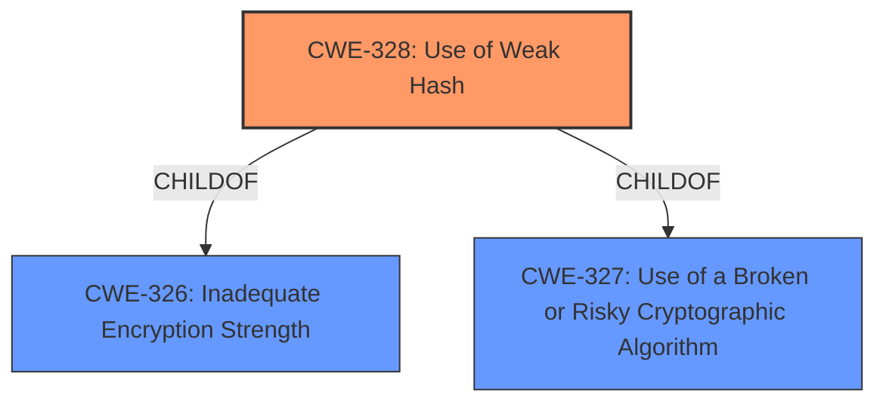

# Raw Analyzer Response for CVE-2022-47931

# Summary
| CWE ID | CWE Name | Confidence | CWE Abstraction Level | CWE Vulnerability Mapping Label | CWE-Vulnerability Mapping Notes |
|---|---|---|---|---|---|
| CWE-328 | Use of Weak Hash | 1.0 | Base | Allowed | Primary CWE |

## Evidence and Confidence

*   **Confidence Score:** 1.0
*   **Evidence Strength:** HIGH

## Relationship Analysis
The primary relationship that influenced the selection was the ChildOf relationship. CWE-328 is a child of CWE-326 and CWE-327, which are related to the use of broken or risky cryptography. This hierarchical relationship underscores the importance of addressing the root cause of using a weak hash algorithm.

## Vulnerability Chain
The vulnerability chain starts with the **collision of hash values** due to the usage of simple separator ("$"). This leads to SHA256/SHA512_256 not behaving like a random oracle. The final impact is potential compromise of shared secrets, unauthorized access to sensitive data, or manipulation of transactions.

## Summary of Analysis
The initial assessment identified CWE-328 as the most appropriate mapping based on the vulnerability description and the CVE reference links.

The vulnerability description clearly states a **collision of hash values**. The CVE Reference Links Content Summary further details that the SHA256 hash function uses a "$" separator during concatenation which can lead to hash collisions if input values also contain the "$" character.

This is explicit evidence that the hash function is **weak** due to its susceptibility to collisions, which aligns perfectly with the description of CWE-328: "The product uses an algorithm that produces a digest (output value) that does not meet security expectations for a hash function that allows an adversary to reasonably determine the original input (preimage attack), find another input that can produce the same hash (2nd preimage attack), or find multiple inputs that evaluate to the same hash (birthday attack)."

The retriever results also support this decision, listing CWE-328 as the top combined result. The mapping guidance for CWE-328 explicitly allows its usage and states that it's at the Base level of abstraction, which is preferred.

Other CWEs were considered but ultimately deemed less suitable. CWE-916 (Use of Password Hash With Insufficient Computational Effort) was considered because the collision can be exploited, but the vulnerability isn't necessarily password related, and is more general. CWE-759 (Use of a One-Way Hash without a Salt) and CWE-760 (Use of a One-Way Hash with a Predictable Salt) are specific to password hashing, making CWE-328 a better fit since the weakness applies to general data hashing.

The selected CWE is at the optimal level of specificity because it directly addresses the root cause of the **weak hash** function due to the use of simple separator.