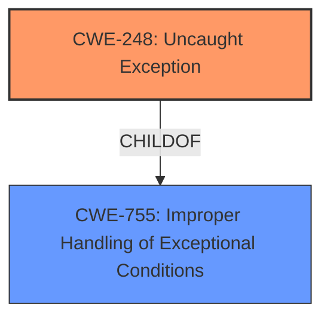

# Analysis Report for CVE-2022-47933

# Vulnerability Analysis Report: CVE-2022-47933

## Description


## Analysis (with Relationship Data)

# Summary
| CWE ID | CWE Name | Confidence | CWE Abstraction Level | CWE Vulnerability Mapping Label | CWE-Vulnerability Mapping Notes |
|---|---|---|---|---|---|
| CWE-248 | Uncaught Exception | 1.0 | Base | Allowed | Primary CWE |
| CWE-755 | Improper Handling of Exceptional Conditions | 0.7 | Class | Discouraged | Secondary Candidate |

## Evidence and Confidence

*   **Confidence Score:** 0.9
*   **Evidence Strength:** HIGH

## Relationship Analysis
The primary relationship influencing the selection was the parent-child relationship between CWE-755 and CWE-248. CWE-248 is a child of CWE-755, providing a more specific classification for the **uncaught exception**. There are no chain relationships that directly apply here. The abstraction level of CWE-248 (Base) is preferred over CWE-755 (Class), further justifying its selection.



## Vulnerability Chain
The vulnerability chain is relatively simple:

1.  **Root Cause:** **Uncaught exception** in `ipfsOnBeforeURLRequest_IPFSRedirectWork()`
2.  **Impact:** Denial of Service

## Summary of Analysis
The initial analysis identified the **uncaught exception** as the root cause, leading to the selection of CWE-248. The CVE description explicitly mentions an **uncaught exception** in the `ipfsOnBeforeURLRequest_IPFSRedirectWork()` function: "This vulnerability is caused by an **uncaught exception** in the function ipfsOnBeforeURLRequest_IPFSRedirectWork() in ipfs_redirect_network_delegate_helper.cc.". The retriever results also list CWE-248 as the top candidate.

CWE-755 (Improper Handling of Exceptional Conditions) was considered but deemed less specific. While CWE-755 broadly covers the failure to handle exceptions, CWE-248 directly addresses the scenario where an exception is thrown but not caught. Given the explicit mention of an **uncaught exception**, CWE-248 provides a more accurate and detailed classification.

The graph relationships support this decision, as CWE-248 is a child of CWE-755, indicating a more specific instance of improper exception handling. The selection of CWE-248 aligns with the principle of choosing the most specific CWE available, which is at the base level.

Relevant CWE Information:

# Enhanced Context (25 CWEs)

## CWE-248: Uncaught Exception
**Abstraction:** Base
**Status:** Draft

### Description
An exception is thrown from a function, but it is not caught.

### Extended Description
When an exception is not caught, it may cause the program to crash or expose sensitive information.

### Alternative Terms
None

### Relationships
ChildOf -> CWE-705
ChildOf -> CWE-755
ChildOf -> CWE-703
ChildOf -> CWE-703

### Mapping Guidance
**Usage:** Allowed
**Rationale:** This CWE entry is at the Base level of abstraction, which is a preferred level of abstraction for mapping to the root causes of vulnerabilities.
**Comments:** Carefully read both the name and description to ensure that this mapping is an appropriate fit. Do not try to 'force' a mapping to a lower-level Base/Variant simply to comply with this preferred level of abstraction.
**Reasons:**
- Acceptable-Use

### Observed Examples
- **CVE-2023-41151:** SDK for OPC Unified Architecture (OPC UA) server has uncaught exception when a socket is blocked for writing but the server tries to send an error
- **CVE-2023-21087:** Java code in a smartphone OS can encounter a "boot loop" due to an uncaught exception

## CWE-755: Improper Handling of Exceptional Conditions
**Abstraction:** Class
**Status:** Incomplete

### Description
The product does not handle or incorrectly handles an exceptional condition.

### Extended Description
Not provided

### Alternative Terms
None

### Relationships
ChildOf -> CWE-703

### Mapping Guidance
**Usage:** Discouraged
**Rationale:** This CWE entry is a level-1 Class (i.e., a child of a Pillar). It might have lower-level children that would be more appropriate
**Comments:** Examine children of this entry to see if there is a better fit
**Reasons:**
- Abstraction

### Observed Examples
- **CVE-2023-41151:** SDK for OPC Unified Architecture (OPC UA) server has uncaught exception when a socket is blocked for writing but the server tries to send an error
- **[REF-1374]:** Chain: JavaScript-based cryptocurrency library can fall back to the insecure Math.random() function instead of reporting a failure (CWE-392), thus reducing the entropy (CWE-332) and leading to generation of non-unique cryptographic keys for Bitcoin wallets (CWE-1391)
- **CVE-2021-3011:** virtual interrupt controller in a virtualization product allows crash of host by writing a certain invalid value to a register, which triggers a fatal error instead of returning an error code


## CWE Relationship Analysis

Current CWEs represent these abstraction levels: .


### Vulnerability Chain Analysis

**Chain starting from CWE-332:**
- 332 (Insufficient Entropy in PRNG) - ROOT


**Chain starting from CWE-755:**
- 755 (Improper Handling of Exceptional Conditions) - ROOT


### CWE Relationship Diagram

```mermaid
graph TD
    classDef primary fill:#f96,stroke:#333,stroke-width:2px
    classDef secondary fill:#69f,stroke:#333
    classDef tertiary fill:#9e9,stroke:#333
```


*Report generated on 2025-03-30 11:32:50*
