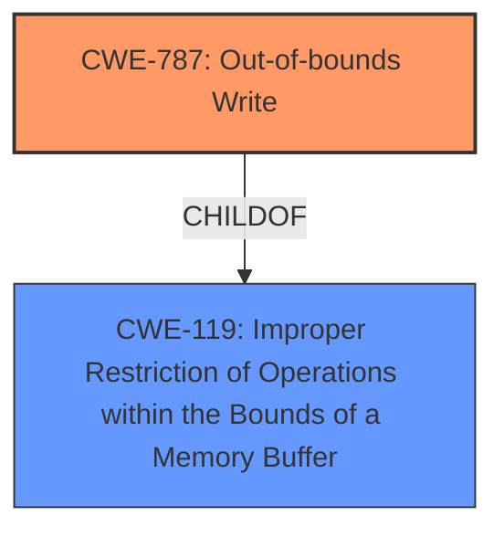

# Raw Analyzer Response for CVE-2022-47935

# Summary
| CWE ID | CWE Name | Confidence | CWE Abstraction Level | CWE Vulnerability Mapping Label | CWE-Vulnerability Mapping Notes |
|---|---|---|---|---|---|
| CWE-787 | Out-of-bounds Write | 1.0 | Base | Allowed | Primary CWE |
| CWE-119 | Improper Restriction of Operations within the Bounds of a Memory Buffer | 0.7 | Class | Discouraged | Secondary Candidate |

## Evidence and Confidence

*   **Confidence Score:** 0.9
*   **Evidence Strength:** HIGH

## Relationship Analysis
The primary CWE, CWE-787 (**CWE-787: Out-of-bounds Write**), is a child of CWE-119 (**CWE-119: Improper Restriction of Operations within the Bounds of a Memory Buffer**). This indicates a hierarchical relationship where CWE-787 is a more specific type of memory buffer issue than CWE-119. The choice of CWE-787 is based on the vulnerability description and CVE details, which explicitly state "**memory corruption**" due to parsing specially crafted JT files, leading to an out-of-bounds write scenario.

## Vulnerability Chain
The vulnerability chain starts with the parsing of a specially crafted JT file, leading to **memory corruption** due to an out-of-bounds write (CWE-787), which can then lead to arbitrary code execution.

## Summary of Analysis
The initial analysis identified CWE-787 (**CWE-787: Out-of-bounds Write**) as the primary candidate based on the "**memory corruption**" vulnerability and the ability for specially crafted JT files to cause **memory corruption**. The CVE Reference Links Content Summary also mentioned "Improper Restriction of Operations within the Bounds of a Memory Buffer" (CWE-119).

The selection of CWE-787 (**CWE-787: Out-of-bounds Write**) is further supported by the "Alternative Terms" within the CWE specifications, which includes "Memory Corruption". This aligns directly with the vulnerability description's key phrase "**memory corruption**". The retriever results also listed CWE-787 as the top combined result.

CWE-119 (**CWE-119: Improper Restriction of Operations within the Bounds of a Memory Buffer**) was considered but is too general. CWE-787 provides a more specific description of the **memory corruption**, specifically an out-of-bounds write.

The evidence supports that the vulnerability is due to writing data past the end or before the beginning of the intended buffer, making CWE-787 the most accurate and specific classification. The choice of CWE-787 is at the optimal level of specificity (Base) and aligns with the provided evidence and mapping guidance.

Relevant CWE Information:
# Enhanced Context (25 CWEs)
The following CWEs were identified as potentially relevant to this vulnerability:

## CWE-787: Out-of-bounds Write
**Abstraction:** Base
**Similarity Score**: 6215.43
**Source**: sparse

**Description**:
The product writes data past the end, or before the beginning, of the intended buffer.

**Mapping Guidance**:
- Usage: Allowed
- Rationale: This CWE entry is at the Base level of abstraction, which is a preferred level of abstraction for mapping to the root causes of vulnerabilities.

## CWE-119: Improper Restriction of Operations within the Bounds of a Memory Buffer
**Abstraction Level**: Class
**Similarity Score**: 6222.88
**Source**: sparse

**Description**:
The product performs operations on a memory buffer, but it reads from or writes to a memory location outside the buffer's intended boundary. This may result in read or write operations on unexpected memory locations that could be linked to other variables, data structures, or internal program data.

**Mapping Guidance**:
- Usage: Discouraged
- Rationale: CWE-119 is commonly misused in low-information vulnerability reports when lower-level CWEs could be used instead, or when more details about the vulnerability are available.