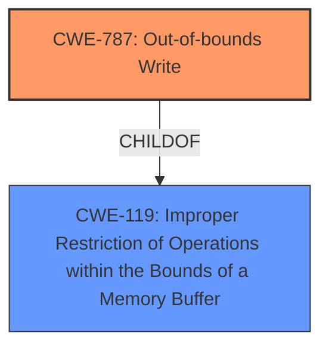

# Analysis Report for CVE-2022-47967

# Vulnerability Analysis Report: CVE-2022-47967

## Description


## Analysis (with Relationship Data)

# Summary
| CWE ID  | CWE Name | Confidence | CWE Abstraction Level | CWE Vulnerability Mapping Label | CWE-Vulnerability Mapping Notes |
|----------------|-----------------------------------------------------------------|-------------------|-------------------------|-----------------------------------|-----------------------------------|
| CWE-787 | Out-of-bounds Write | 1.0 | Base | Allowed |  This CWE entry is at the Base level of abstraction, which is a preferred level of abstraction for mapping to the root causes of vulnerabilities. |
| CWE-119 | Improper Restriction of Operations within the Bounds of a Memory Buffer | 0.7 | Class | Discouraged | CWE-119 is commonly misused in low-information vulnerability reports when lower-level CWEs could be used instead, or when more details about the vulnerability are available.  |

## Evidence and Confidence

*   **Confidence Score:** 0.9
*   **Evidence Strength:** HIGH

## Relationship Analysis
The primary CWE selected is CWE-787 (Out-of-bounds Write), which is a child of CWE-119 (Improper Restriction of Operations within the Bounds of a Memory Buffer). This hierarchical relationship indicates that CWE-787 is a more specific type of memory buffer issue. Given the vulnerability description's focus on **memory corruption** and the potential for code execution, CWE-787 provides a more precise classification. While CWE-119 is a parent class, it's discouraged due to its broad nature and potential for misuse when more specific CWEs are available.



## Vulnerability Chain
The vulnerability chain involves:
1.  **Root Cause:** **Memory corruption** in DOCMGMT.DLL while parsing files. This is best represented by CWE-787 (Out-of-bounds Write).
2.  **Weakness:** The parsing process **fails to properly** handle file formats (PAR, ASM, DFT), leading to the **memory corruption**.
3.  **Impact:** An attacker can execute arbitrary code within the context of the current process.

## Summary of Analysis
The initial analysis focused on the **memory corruption** vulnerability within the DOCMGMT.DLL when parsing specific file formats. The key phrase "memory corruption" and the resulting remote code execution strongly suggested a memory-related issue.

The retriever results highlighted several relevant CWEs, including CWE-787 (Out-of-bounds Write), CWE-119 (Improper Restriction of Operations within the Bounds of a Memory Buffer), and others related to buffer overflows and reads.

The relationship analysis revealed that CWE-787 is a child of CWE-119, indicating a more specific type of memory buffer issue. Given the vulnerability description's details, CWE-787 provides a more accurate and precise classification.

The MITRE mapping guidance discourages the use of CWE-119 when more specific CWEs are available. Therefore, CWE-787 was selected as the primary CWE, as it directly addresses the out-of-bounds write condition leading to **memory corruption**.

The evidence supporting this decision includes:

*   "A vulnerability has been identified in Solid Edge (All versions < V2023 MP1). The DOCMGMT.DLL contains a **memory corruption** vulnerability that could be triggered while parsing files in different file formats such as PAR, ASM, DFT."
*   "**Root cause of vulnerability:** A **memory corruption** vulnerability exists within the DOCMGMT.DLL when parsing files in various formats such as PAR, ASM, and DFT."
*   "**Weaknesses/vulnerabilities present:** **Memory corruption** (CWE-119: Improper Restriction of Operations within the Bounds of a Memory Buffer)"
*   "Impact of exploitation: An attacker could achieve remote code execution within the context of the current process."

CWE-119 was considered as a secondary CWE because it represents a broader category of memory buffer issues. However, the specific nature of the vulnerability, involving writing past the end of a buffer, makes CWE-787 the more appropriate primary classification.

The selected CWEs are at the optimal level of specificity because they directly address the root cause of the vulnerability (out-of-bounds write) and its broader context (improper restriction of memory buffer operations).

Relevant CWE Information:

# Enhanced Context (25 CWEs)
The following CWEs were identified as potentially relevant to this vulnerability:

## CWE-191: Integer Underflow (Wrap or Wraparound)
**Abstraction Level**: Base
**Similarity Score**: 0.77
**Source**: dense

**Description**:
The product subtracts one value from another, such that the result is less than the minimum allowable integer value, which produces a value that is not equal to the correct result.

**Mapping Guidance**:
- Usage: Allowed
- Rationale: This CWE entry is at the Base level of abstraction, which is a preferred level of abstraction for mapping to the root causes of vulnerabilities.

## CWE-805: Buffer Access with Incorrect Length Value
**Abstraction Level**: Base
**Similarity Score**: 0.76
**Source**: dense

**Description**:
The product uses a sequential operation to read or write a buffer, but it uses an incorrect length value that causes it to access memory that is outside of the bounds of the buffer.

**Mapping Guidance**:
- Usage: Allowed
- Rationale: This CWE entry is at the Base level of abstraction, which is a preferred level of abstraction for mapping to the root causes of vulnerabilities.

## CWE-131: Incorrect Calculation of Buffer Size
**Abstraction Level**: Base
**Similarity Score**: 0.75
**Source**: dense

**Description**:
The product does not correctly calculate the size to be used when allocating a buffer, which could lead to a buffer overflow.

**Mapping Guidance**:
- Usage: Allowed
- Rationale: This CWE entry is at the Base level of abstraction, which is a preferred level of abstraction for mapping to the root causes of vulnerabilities.

## CWE-126: Buffer Over-read
**Abstraction Level**: Variant
**Similarity Score**: 0.75
**Source**: dense

**Description**:
The product reads from a buffer using buffer access mechanisms such as indexes or pointers that reference memory locations after the targeted buffer.

**Mapping Guidance**:
- Usage: Allowed
- Rationale: This CWE entry is at the Variant level of abstraction, which is a preferred level of abstraction for mapping to the root causes of vulnerabilities.

## CWE-125: Out-of-bounds Read
**Abstraction Level**: Base
**Similarity Score**: 0.75
**Source**: dense

**Description**:
The product reads data past the end, or before the beginning, of the intended buffer.

**Mapping Guidance**:
- Usage: Allowed
- Rationale: This CWE entry is at the Base level of abstraction, which is a preferred level of abstraction for mapping to the root causes of vulnerabilities.

## CWE-127: Buffer Under-read
**Abstraction Level**: Variant
**Similarity Score**: 0.75
**Source**: dense

**Description**:
The product reads from a buffer using buffer access mechanisms such as indexes or pointers that reference memory locations prior to the targeted buffer.

**Mapping Guidance**:
- Usage: Allowed
- Rationale: This CWE entry is at the Variant level of abstraction, which is a preferred level of abstraction for mapping to the root causes of vulnerabilities.

## CWE-197: Numeric Truncation Error
**Abstraction Level**: Base
**Similarity Score**: 0.75
**Source**: dense

**Description**:
Truncation errors occur when a primitive is cast to a primitive of a smaller size and data is lost in the conversion.

**Mapping Guidance**:
- Usage: Allowed
- Rationale: This CWE entry is at the Base level of abstraction, which is a preferred level of abstraction for mapping to the root causes of vulnerabilities.

## CWE-823: Use of Out-of-range Pointer Offset
**Abstraction Level**: Base
**Similarity Score**: 0.75
**Source**: dense

**Description**:
The product performs pointer arithmetic on a valid pointer, but it uses an offset that can point outside of the intended range of valid memory locations for the resulting pointer.

**Mapping Guidance**:
- Usage: Allowed
- Rationale: This CWE entry is at the Base level of abstraction, which is a preferred level of abstraction for mapping to the root causes of vulnerabilities.

## CWE-124: Buffer Underwrite ('Buffer Underflow')
**Abstraction Level**: Base
**Similarity Score**: 0.74
**Source**: dense

**Description**:
The product writes to a buffer using an index or pointer that references a memory location prior to the beginning of the buffer.

**Mapping Guidance**:
- Usage: Allowed
- Rationale: This CWE entry is at the Base level of abstraction, which is a preferred level of abstraction for mapping to the root causes of vulnerabilities.

## CWE-


## CWE Relationship Analysis

Current CWEs represent these abstraction levels: .


### Vulnerability Chain Analysis

**Chain starting from CWE-131:**
- 131 (Incorrect Calculation of Buffer Size) - ROOT


**Chain starting from CWE-805:**
- 805 (Buffer Access with Incorrect Length Value) - ROOT


### CWE Relationship Diagram

```mermaid
graph TD
    classDef primary fill:#f96,stroke:#333,stroke-width:2px
    classDef secondary fill:#69f,stroke:#333
    classDef tertiary fill:#9e9,stroke:#333
```


*Report generated on 2025-03-30 11:40:47*
