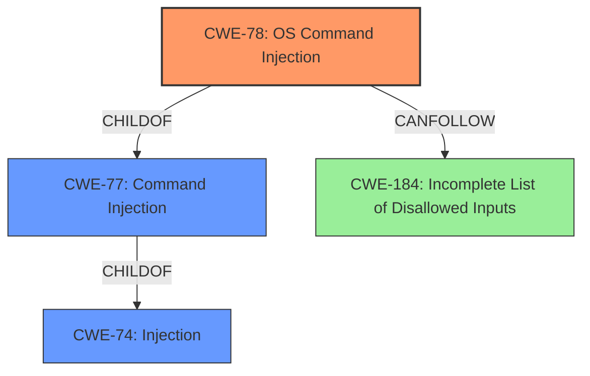

# Enhanced Analysis for CVE-2022-48093

# Summary
| CWE ID | CWE Name | Confidence | CWE Abstraction Level | CWE Vulnerability Mapping Label | CWE-Vulnerability Mapping Notes |
|---|---|---|---|---|---|
| CWE-78 | Improper Neutralization of Special Elements used in an OS Command ('OS Command Injection') | 0.9 | Base | Allowed | Primary CWE. The application constructs an OS command using external input without proper neutralization, leading to remote code execution. |
| CWE-77 | Improper Neutralization of Special Elements used in a Command ('Command Injection') | 0.7 | Class | Allowed-with-Review | Secondary candidate. Could be a more general case of command injection, but CWE-78 is more specific to OS commands. |
| CWE-74 | Improper Neutralization of Special Elements in Output Used by a Downstream Component ('Injection') | 0.6 | Class | Discouraged | Secondary candidate. A general injection issue; however, CWE-78 is more specific. |

## Evidence and Confidence

*   **Confidence Score:** 0.9
*   **Evidence Strength:** HIGH

## Relationship Analysis
The analysis focused on the hierarchical relationships between CWEs related to command injection. CWE-78 is a child of CWE-77, which in turn is a child of CWE-74. The decision favored CWE-78 due to its specificity regarding OS commands, aligning directly with the vulnerability description indicating remote code execution via command injection. The chain relationship of CANFOLLOW -> CWE-184 suggests potential issues with incomplete input validation. Abstraction levels were considered to choose the most specific and relevant CWE, with Base level CWE-78 being preferred over the Class level CWE-77 and CWE-74.



## Vulnerability Chain
The vulnerability chain starts with the **improper neutralization** of special elements within the `ip` parameter, leading to OS command injection and ultimately, remote code execution.
  - **Root Cause:** **Improper Neutralization** of special elements in the `ip` parameter at `admin_ip.php`.
  - **Weakness:** OS Command Injection (CWE-78)
  - **Impact:** Remote Code Execution (RCE)

## Summary of Analysis
The initial assessment strongly pointed towards command injection due to the vulnerability description explicitly mentioning remote code execution via the `ip` parameter. The retriever results confirmed this direction, with CWE-78 and related CWEs appearing at the top.

The final decision to assign CWE-78 as the primary CWE is based on the following:

1.  **Vulnerability Description:** The description states "remote code execution (RCE) vulnerability via the ip parameter at admin_ ip.php," which strongly suggests command injection.
2.  **Retriever Results:** CWE-78 is among the top results, reinforcing the command injection hypothesis.
3.  **CWE Specifications:** CWE-78 specifically addresses "Improper Neutralization of Special Elements used in an OS Command," which aligns perfectly with the vulnerability involving the `ip` parameter.
4.  **Relationship Analysis:** CWE-78 is a more specific child of CWE-77, which is a more general "Command Injection."

The evidence clearly supports the selection of CWE-78 as the primary weakness, indicating that the application constructs an OS command using external input without proper neutralization, leading to remote code execution. The confidence level is high due to the explicit mention of RCE and the alignment of CWE-78's description with the vulnerability details.

CWE-77 and CWE-74 were considered but not chosen as the primary CWE because they are more general and less specific than CWE-78. While they could potentially apply, CWE-78 provides a more accurate and detailed representation of the vulnerability.

Other CWEs considered but deemed less relevant include:
* CWE-96: Static Code Injection - This doesn't fit the dynamic nature of the vulnerability.
* CWE-89: SQL Injection - Not applicable as the vulnerability involves OS commands, not SQL queries.
* CWE-95: Eval Injection - Not applicable as the vulnerability involves OS commands, not code evaluation.
* CWE-22: Path Traversal - Not applicable as the vulnerability involves OS commands, not file paths.
* CWE-79: Cross-site Scripting - Not applicable as the vulnerability involves OS commands, not web page generation.

Relevant CWE Information:

# Enhanced Context (25 CWEs)

## CWE-184: Incomplete List of Disallowed Inputs
**Abstraction Level**: Base
**Similarity Score**: 0.78
**Source**: dense

**Description**:
The product implements a protection mechanism that relies on a list of inputs (or properties of inputs) that are not allowed by policy or otherwise require other action to neutralize before additional processing takes place, but the list is incomplete.

**Mapping Guidance**:
- Usage: Allowed
- Rationale: This CWE entry is at the Base level of abstraction, which is a preferred level of abstraction for mapping to the root causes of vulnerabilities.

## CWE-434: Unrestricted Upload of File with Dangerous Type
**Abstraction Level**: Base
**Similarity Score**: 0.77
**Source**: dense

**Description**:
The product allows the upload or transfer of dangerous file types that are automatically processed within its environment.

**Mapping Guidance**:
- Usage: Allowed
- Rationale: This CWE entry is at the Base level of abstraction, which is a preferred level of abstraction for mapping to the root causes of vulnerabilities.

## CWE-183: Permissive List of Allowed Inputs
**Abstraction Level**: Base
**Similarity Score**: 0.76
**Source**: dense

**Description**:
The product implements a protection mechanism that relies on a list of inputs (or properties of inputs) that are explicitly allowed by policy because the inputs are assumed to be safe, but the list is too permissive - that is, it allows an input that is unsafe, leading to resultant weaknesses.

**Mapping Guidance**:
- Usage: Allowed
- Rationale: This CWE entry is at the Base level of abstraction, which is a preferred level of abstraction for mapping to the root causes of vulnerabilities.

## CWE-74: Improper Neutralization of Special Elements in Output Used by a Downstream Component ('Injection')
**Abstraction Level**: Class
**Similarity Score**: 0.75
**Source**: dense

**Description**:
The product constructs all or part of a command, data structure, or record using externally-influenced input from an upstream component, but it does not neutralize or incorrectly neutralizes special elements that could modify how it is parsed or interpreted when it is sent to a downstream component.

**Mapping Guidance**:
- Usage: Discouraged
- Rationale: CWE-74 is high-level and often misused when lower-level weaknesses are more appropriate.

## CWE-1289: Improper Validation of Unsafe Equivalence in Input
**Abstraction Level**: Base
**Similarity Score**: 0.75
**Source**: dense

**Description**:
The product receives an input value that is used as a resource identifier or other type of reference, but it does not validate or incorrectly validates that the input is equivalent to a potentially-unsafe value.

**Mapping Guidance**:
- Usage: Allowed
- Rationale: This CWE entry is at the Base level of abstraction, which is a preferred level of abstraction for mapping to the root causes of vulnerabilities.

## CWE-73: External Control of File Name or Path
**Abstraction Level**: Base
**Similarity Score**: 0.75
**Source**: dense

**Description**:
The product allows user input to control or influence paths or file names that are used in filesystem operations.

**Mapping Guidance**:
- Usage: Allowed
- Rationale: This CWE entry is at the Base level of abstraction, which is a preferred level of abstraction for mapping to the root causes of vulnerabilities.

## CWE-138: Improper Neutralization of Special Elements
**Abstraction Level**: Class
**Similarity Score**: 0.75
**Source**: dense

**Description**:
The product receives input from an upstream component, but it does not neutralize or incorrectly neutralizes special elements that could be interpreted as control elements or syntactic markers when they are sent to a downstream component.

**Mapping Guidance**:
- Usage: Discouraged
- Rationale: This CWE entry is a level-1 Class (i.e., a child of a Pillar). It might have lower-level children that would be more appropriate

## CWE-552: Files or Directories Accessible to External Parties
**Abstraction Level**: Base
**Similarity Score**: 0.7


## CWE Relationship Analysis

Current CWEs represent these abstraction levels: .


### Vulnerability Chain Analysis

**Chain starting from CWE-89:**
- 89 (Improper Neutralization of Special Elements used in an SQL Command ('SQL Injection')) - ROOT


**Chain starting from CWE-552:**
- 552 (Files or Directories Accessible to External Parties) - ROOT


### CWE Relationship Diagram

```mermaid
graph TD
    classDef primary fill:#f96,stroke:#333,stroke-width:2px
    classDef secondary fill:#69f,stroke:#333
    classDef tertiary fill:#9e9,stroke:#333
```