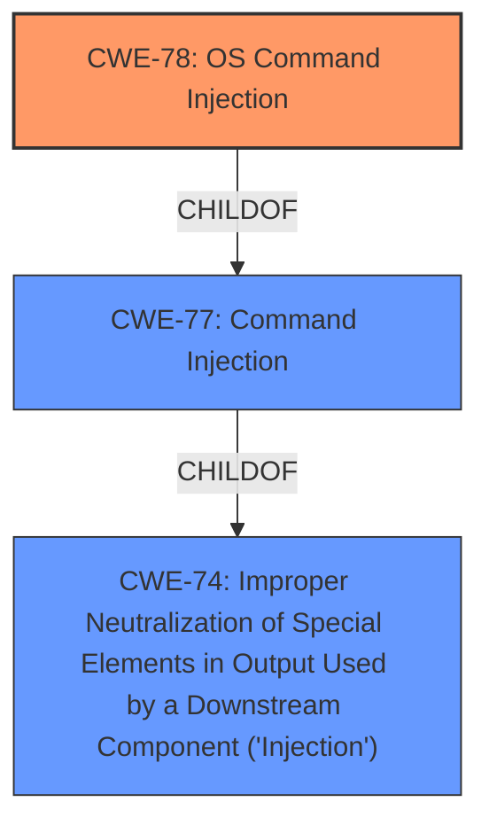

# Analysis Report for CVE-2022-48107

# Vulnerability Analysis Report: CVE-2022-48107

## Description


## Analysis (with Relationship Data)

# Summary
| CWE ID | CWE Name | Confidence | CWE Abstraction Level | CWE Vulnerability Mapping Label | CWE-Vulnerability Mapping Notes |
|---|---|---|---|---|---|
| CWE-78 | Improper Neutralization of Special Elements used in an OS Command ('OS Command Injection') | 1.0 | Base | Allowed | Primary CWE |

## Evidence and Confidence

*   **Confidence Score:** 1.0
*   **Evidence Strength:** HIGH

## Relationship Analysis
The primary relationship influencing the decision is the ChildOf relationship between CWE-78 and CWE-77. While CWE-77 (Command Injection) is a broader class, CWE-78 (OS Command Injection) is a base-level CWE and a more specific type of command injection, which aligns perfectly with the vulnerability description. The Retriever results also indicate that CWE-78 is a more appropriate selection when the command injection involves OS commands.



## Vulnerability Chain
The vulnerability chain involves the following steps:
1.  Improper handling of user-supplied input in the `/setnetworksettings/IPAddress` component.
2.  Lack of input sanitization.
3.  The `IPAddress` parameter is passed to a `sprintf` function without proper neutralization.
4.  The formatted command string is executed by a `system` function leading to **command injection**.
5.  Privilege escalation to root.

## Summary of Analysis
The initial assessment, based on the vulnerability description, points directly to **command injection**. The key phrase "command injection vulnerability via the component /setnetworksettings/IPAddress" clearly indicates this type of weakness. The Retriever Results also supports this assessment.

The vulnerability description key phrases also contain "escalate privileges to root", which is the impact of the **command injection**.

The CVE Reference Links Content Summary provides strong supporting evidence: "The vulnerability is caused by **improper handling of user-supplied input** in the `/setnetworksettings/IPAddress` component...the `IPAddress` parameter is passed to a `sprintf` function which formats it into a command string which is then executed by a `system` function. This allows an attacker to inject arbitrary commands into the formatted command string." This quote directly supports the **command injection** classification.

CWE-77 (Improper Neutralization of Special Elements used in a Command ('Command Injection')) and CWE-78 (Improper Neutralization of Special Elements used in an OS Command ('OS Command Injection')) are both potential candidates. However, given the context of the D-Link router and the use of a `system` function, CWE-78 is the more specific and appropriate choice.

CWE-74 (Improper Neutralization of Special Elements in Output Used by a Downstream Component ('Injection')) is too high-level and doesn't provide enough specificity. Other CWEs like CWE-184, CWE-1336, and CWE-116 are not directly relevant as they represent different types of weaknesses or are related to output encoding rather than command execution.

The selected CWE, CWE-78, is at the optimal level of specificity, as it accurately reflects the root cause of the vulnerability: the **improper neutralization of special elements** in an OS command. This directly leads to the ability to inject and execute arbitrary commands on the system. The confidence in this assessment is high (1.0) due to the clear evidence and alignment with the CWE description and mapping guidance.


## CWE Relationship Analysis

Current CWEs represent these abstraction levels: .


### Vulnerability Chain Analysis

**Chain starting from CWE-184:**
- 184 (Incomplete List of Disallowed Inputs) - ROOT


**Chain starting from CWE-78:**
- 78 (Improper Neutralization of Special Elements used in an OS Command ('OS Command Injection')) - ROOT


### CWE Relationship Diagram

```mermaid
graph TD
    classDef primary fill:#f96,stroke:#333,stroke-width:2px
    classDef secondary fill:#69f,stroke:#333
    classDef tertiary fill:#9e9,stroke:#333
```


*Report generated on 2025-03-30 15:28:45*
