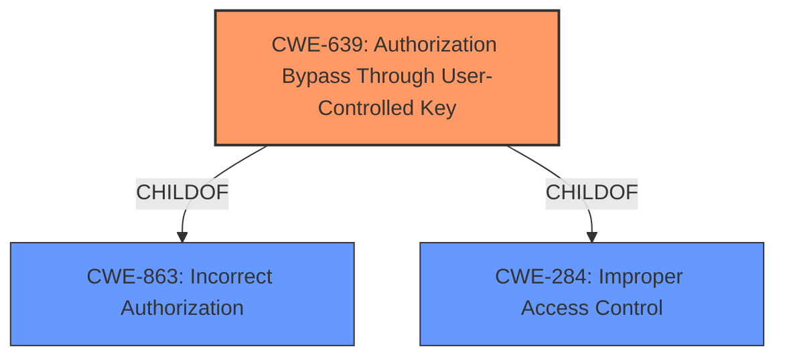

# Analysis Report for CVE-2022-4811

# Vulnerability Analysis Report: CVE-2022-4811

## Description


## Analysis (with Relationship Data)

# Summary
| CWE ID    | CWE Name                                                                    | Confidence | CWE Abstraction Level | CWE Vulnerability Mapping Label | CWE-Vulnerability Mapping Notes |
| :-------- | :-------------------------------------------------------------------------- | :--------- | :-------------------- | :------------------------------ | :------------------------------ |
| CWE-639   | Authorization Bypass Through User-Controlled Key                            | 1.0        | Base                  | Primary                         | Allowed                         |
| CWE-284   | Improper Access Control                                                     | 0.6        | Pillar                | Secondary                       | Discouraged                     |
| CWE-863   | Incorrect Authorization                                                     | 0.5        | Class                 | Secondary                       | Allowed-with-Review             |

## Evidence and Confidence

*   **Confidence Score:** 0.8
*   **Evidence Strength:** HIGH

## Relationship Analysis
The primary CWE selected is CWE-639 [Authorization Bypass Through User-Controlled Key], which is a Base level CWE. This is a child of both CWE-863 [Incorrect Authorization] and CWE-284 [Improper Access Control]. While CWE-863 [Incorrect Authorization] could be considered, it's a Class level CWE, and CWE-639 [Authorization Bypass Through User-Controlled Key] provides a more specific classification of the vulnerability. CWE-284 [Improper Access Control] is a Pillar level CWE and is too general.



## Vulnerability Chain
The chain of events for this vulnerability is:
1.  **Root Cause:** **User-Controlled Key** is used in the authorization process.
2.  **Weakness:** The system **fails to properly** validate or sanitize the **User-Controlled Key**.
3.  **Impact:** An **authorization bypass** occurs, allowing unauthorized access to resources.

## Summary of Analysis
The initial analysis focused on the **authorization bypass** due to a **user-controlled key**. The commit diff reveals that the `CreatorID` field was being exposed, which allowed for potential manipulation.

The primary CWE, CWE-639 [Authorization Bypass Through User-Controlled Key], aligns directly with the vulnerability description and the provided commit details. The commit addresses an access control vulnerability stemming from the potential exposure of internal `CreatorID` values through the API responses. Before the commit, the `CreatorID` field was not explicitly excluded in API response structs, potentially revealing this ID when data was serialized into JSON.

The selection of CWE-639 [Authorization Bypass Through User-Controlled Key] is at the appropriate level of specificity (Base) and is supported by the evidence. The vulnerability involves a key that is controlled by the user and is used in the authorization process, leading to a bypass.

The supporting evidence is the "CVE Reference Links Content Summary" that details how the `CreatorID` field was exposed and how this could be manipulated.

Relevant CWE Information:

# Enhanced Context (25 CWEs)

## CWE-639: Authorization Bypass Through User-Controlled Key
**Abstraction Level**: Base
**Similarity Score**: 0.77
**Source**: dense

**Description**:
The system's authorization functionality does not prevent one user from gaining access to another user's data or record by modifying the key value identifying the data.

**Mapping Guidance**:
- Usage: Allowed
- Rationale: This CWE entry is at the Base level of abstraction, which is a preferred level of abstraction for mapping to the root causes of vulnerabilities.

**Technical Explanation:**

CWE-639 [Authorization Bypass Through User-Controlled Key] directly applies because the vulnerability allows a user to potentially gain access to another user's data by manipulating the `CreatorID`. The `CreatorID` acts as the key, and the system **does not properly** validate or sanitize this key before using it for authorization.

**Security Implications:**

The security implication is a direct **authorization bypass**, which can lead to unauthorized access to sensitive information or resources.

**Hierarchical Relationships:**

CWE-639 [Authorization Bypass Through User-Controlled Key] is a child of CWE-863 [Incorrect Authorization] and CWE-284 [Improper Access Control], providing a more specific classification.

**Mapping Guidance Influence:**

The MITRE mapping guidance recommends using Base-level CWEs when possible, which supports the selection of CWE-639 [Authorization Bypass Through User-Controlled Key].

**CWEs Considered But Not Used:**

*   CWE-284 [Improper Access Control]: While this is a relevant CWE, it is too high-level (Pillar) and doesn't provide enough specificity.
*   CWE-863 [Incorrect Authorization]: This is a Class-level CWE. CWE-639 [Authorization Bypass Through User-Controlled Key] is a child of this CWE and is more specific.
*   CWE-472 [External Control of Assumed-Immutable Web Parameter]: This CWE is similar, but it focuses on assumed-immutable parameters, while the core issue here is the authorization bypass via the user-controlled key.
*   CWE-566 [Authorization Bypass Through User-Controlled SQL Primary Key]: This is too specific to SQL databases, while the vulnerability is more general.


## CWE Relationship Analysis

Current CWEs represent these abstraction levels: .


### Vulnerability Chain Analysis

**Chain starting from CWE-472:**
- 472 (External Control of Assumed-Immutable Web Parameter) - ROOT


**Chain starting from CWE-566:**
- 566 (Authorization Bypass Through User-Controlled SQL Primary Key) - ROOT


### CWE Relationship Diagram

```mermaid
graph TD
    classDef primary fill:#f96,stroke:#333,stroke-width:2px
    classDef secondary fill:#69f,stroke:#333
    classDef tertiary fill:#9e9,stroke:#333
```


*Report generated on 2025-03-30 13:17:19*
