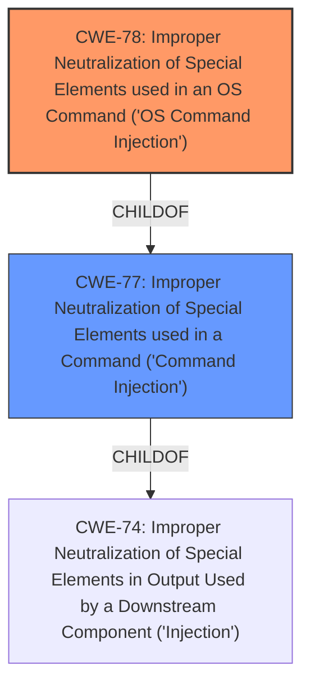

# Enhanced Analysis for CVE-2022-48123

# Summary
| CWE ID | CWE Name | Confidence | CWE Abstraction Level | CWE Vulnerability Mapping Label | CWE-Vulnerability Mapping Notes |
|---|---|---|---|---|---|
| CWE-78 | Improper Neutralization of Special Elements used in an OS Command ('OS Command Injection') | 1.0 | Base | Allowed | Primary CWE |
| CWE-77 | Improper Neutralization of Special Elements used in a Command ('Command Injection') | 0.7 | Class | Allowed-with-Review | Secondary Candidate |

## Evidence and Confidence

*   **Confidence Score:** 0.9
*   **Evidence Strength:** HIGH

## Relationship Analysis
The primary relationship impacting the CWE selection is the child-of relationship between CWE-78 and CWE-77. Since the command injection occurs within the context of an OS command, CWE-78 is the more specific and appropriate choice. The retriever results also support this, with CWE-78 being a close second to CWE-77 based on the description and the graph analysis.



## Vulnerability Chain
The chain of events is as follows:
1.  Improper handling of user-supplied input (`servername` parameter)
2.  **Command Injection** (CWE-78) due to lack of sanitization
3.  Arbitrary command execution leading to full system compromise.

The root cause is the **lack of input sanitization**, leading to the **command injection**, which in turn allows arbitrary command execution.

## Summary of Analysis
The initial assessment pointed towards CWE-77, based on the **weakness** being described as a **command injection** vulnerability. However, a closer examination of the vulnerability description, especially the CVE Reference Links Content Summary, revealed that the injected command is specifically an OS command. Therefore, CWE-78, which is a more specific child of CWE-77, is a better fit.

The evidence from the CVE Reference Links Content Summary states: "User-controlled data is directly passed to a shell command, enabling an attacker to execute arbitrary commands on the router's operating system." This clearly indicates that the **command injection** is related to an OS command.

The graph relationships also support this, as CWE-78 is a child of CWE-77. The mapping guidance for CWE-77 suggests considering CWE-78 when the injection involves an OS command. The selected CWE is at the Base level of specificity, which is the most appropriate level for this vulnerability.

# Relevant CWE Information:

## Vulnerability Description
TOTOlink A7100RU V7.4cu.2313_B20191024 was discovered to contain a **command injection** vulnerability via the servername parameter in the setting/delStaticDhcpRules function.

### Vulnerability Description Key Phrases
- **weakness:** **command injection**
- **product:** TOTOlink A7100RU
- **version:** V7.4cu.2313_B20191024
- **component:** setting/delStaticDhcpRules function

### CWE for similar CVE Descriptions
### Primary CWE Match
CWE-77

#### Top CWEs
- CWE-77 (Count: 96)
- CWE-78 (Count: 93)
- CWE-787 (Count: 11)

## CVE Reference Links Content Summary
Based on the provided content, here's a breakdown of the vulnerability:

**Root Cause:**

The root cause of the vulnerability is the improper handling of user-supplied input in the `cgi-bin/cstecgi.cgi` script of the TOTOlink A7100RU router. Specifically, the `servername` parameter is taken from the user, passed to the `Uci_Set_Str` function, then formatted using `snprintf` and eventually executed in a shell using `execv` without proper sanitization or validation.

**Weaknesses/Vulnerabilities Present:**

*   **Command Injection:** The primary vulnerability is command injection. User-controlled data is directly passed to a shell command, enabling an attacker to execute arbitrary commands on the router's operating system.
*   **Lack of Input Sanitization/Validation:** The code lacks proper input validation and sanitization on the `servername` parameter before using it in shell commands. This allows an attacker to insert shell metacharacters and commands.

**Impact of Exploitation:**

*   **Arbitrary Command Execution:** Successful exploitation allows an attacker to execute arbitrary commands with the privileges of the webserver.
*   **Full System Compromise:** The attacker can gain a root shell by injecting commands and thus gain complete control over the router.

**Attack Vectors:**

*   HTTP POST Request:** The attack is triggered by sending a crafted HTTP POST request to the `/cgi-bin/cstecgi.cgi` endpoint. The vulnerable parameter is sent within the JSON body.

**Required Attacker Capabilities/Position:**

*   **Network Access:** The attacker needs network access to the router's web interface. This could be over the local network or, if the router's web interface is exposed, over the internet.
*   **Understanding of the API:** The attacker needs to know that the parameter `servername` within the provided JSON is a vulnerable injection point.

## CWE-78: Improper Neutralization of Special Elements used in an OS Command ('OS Command Injection')
**Explanation:** The vulnerability involves injecting commands into the operating system via the `servername` parameter. This aligns perfectly with the description of CWE-78, which focuses on the **improper neutralization** of special elements used in constructing OS commands. The product fails to sanitize user-supplied input, allowing an attacker to inject arbitrary OS commands.
**Security Implications:** This vulnerability allows an attacker to execute arbitrary commands on the router's operating system, potentially leading to full system compromise.
**Relationship:** CWE-78 is a child of CWE-77, which is a more general class of command injection vulnerabilities.
**MITRE Mapping Guidance:** The mapping guidance for CWE-78 recommends its use when the vulnerability involves injecting OS commands, which is precisely the case here.

## CWE-77: Improper Neutralization of Special Elements used in a Command ('Command Injection')
**Explanation:** While the initial description points to a **command injection** vulnerability, which aligns with CWE-77, the specifics indicate that it's an OS command injection. Therefore, CWE-77 is considered a secondary candidate.
**Security Implications:** Similar to CWE-78, this allows command execution.
**Relationship:** CWE-77 is a parent of CWE-78, representing a broader category of command injection.
**MITRE Mapping Guidance:** The mapping guidance for CWE-77 suggests considering CWE-78 when the injection involves an OS command.

### Other CWEs Considered But Not Used
CWE-74, CWE-94, CWE-89, CWE-259, CWE-184, CWE-121, CWE-88, CWE-96, CWE-790 were considered but not used because they did not accurately reflect the specific nature of the **command injection** vulnerability. Specifically, these CWEs address different types of injection (e.g., SQL, code) or other weaknesses that are not the primary cause of this vulnerability. The focus is on the **improper neutralization** of special elements within an OS command, making CWE-78 the most appropriate choice.


## CWE Relationship Analysis

Current CWEs represent these abstraction levels: .


### Vulnerability Chain Analysis

**Chain starting from CWE-89:**
- 89 (Improper Neutralization of Special Elements used in an SQL Command ('SQL Injection')) - ROOT


**Chain starting from CWE-96:**
- 96 (Improper Neutralization of Directives in Statically Saved Code ('Static Code Injection')) - ROOT


### CWE Relationship Diagram

```mermaid
graph TD
    classDef primary fill:#f96,stroke:#333,stroke-width:2px
    classDef secondary fill:#69f,stroke:#333
    classDef tertiary fill:#9e9,stroke:#333
```