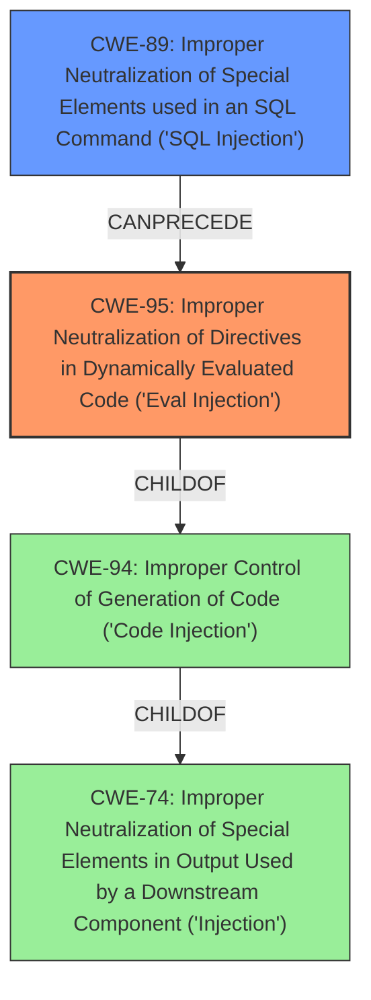

# Enhanced Analysis for CVE-2022-48175

# Summary
| CWE ID | CWE Name | Confidence | CWE Abstraction Level | CWE Vulnerability Mapping Label | CWE-Vulnerability Mapping Notes |
|---|---|---|---|---|---|
| CWE-95 | Improper Neutralization of Directives in Dynamically Evaluated Code ('Eval Injection') | 0.9 | Variant | Allowed | Primary CWE: The application dynamically evaluates code based on unsanitized input, allowing for arbitrary code execution. |
| CWE-89 | Improper Neutralization of Special Elements used in an SQL Command ('SQL Injection') | 0.8 | Base | Allowed | Secondary CWE: The attacker leverages an SQL Injection to insert the malicious code into the database. This is a prerequisite for CWE-95. |

## Evidence and Confidence

*   **Confidence Score:** 0.85
*   **Evidence Strength:** HIGH

## Relationship Analysis
The primary weakness is CWE-95, as the root cause is the **improper neutralization** of directives leading to code evaluation. CWE-89 is a prerequisite, where **SQL injection** is exploited to inject malicious code into the database. CWE-95 is a variant of CWE-94 (Improper Control of Generation of Code), which is a child of CWE-74 (Improper Neutralization of Special Elements in Output Used by a Downstream Component ('Injection')).



## Vulnerability Chain
1.  **SQL Injection (CWE-89):** The attacker exploits an **SQL injection** vulnerability to insert malicious data into the `app_fields` table.
2.  **Improper Neutralization (CWE-95):** The application **fails to sanitize** the `configuration` field, allowing the injected PHP code to be dynamically evaluated.
3.  **Remote Code Execution (Impact):** The injected code is executed, leading to RCE.

## Summary of Analysis
The primary vulnerability is CWE-95 because the application dynamically evaluates code from a database field that is not properly sanitized. This allows an attacker to inject and execute arbitrary PHP code. The vulnerability description states, "The vulnerability stems from the ability to inject and execute arbitrary PHP code by manipulating database entries... The `configuration` field of a `fieldtype_ajax_request` is designed to store configuration data but is not properly sanitized, allowing an attacker to inject PHP code for execution."

CWE-89 is a secondary vulnerability because the attacker leverages an **SQL injection** vulnerability to insert the malicious code into the database. The description states, "The attacker leverages an unspecified SQL injection vulnerability to insert a malicious entry into the `app_fields` table."

CWE-95 is at the Variant level, which is the preferred level of abstraction. CWE-89 is at the Base level, which is also preferred.

CWE-78 (Improper Neutralization of Special Elements used in an OS Command ('OS Command Injection')) was considered because the RCE could lead to the execution of arbitrary OS commands. However, the root cause is the **improper neutralization** of code directives, not OS command elements. Therefore, CWE-78 is not an appropriate mapping.

CWE-79 (Improper Neutralization of Input During Web Page Generation ('Cross-site Scripting')) was considered, but it involves the generation of web pages with unsanitized input, which is not the case here.


## CWE Relationship Analysis

Current CWEs represent these abstraction levels: .


### Vulnerability Chain Analysis

**Chain starting from CWE-89:**
- 89 (Improper Neutralization of Special Elements used in an SQL Command ('SQL Injection')) - ROOT


**Chain starting from CWE-78:**
- 78 (Improper Neutralization of Special Elements used in an OS Command ('OS Command Injection')) - ROOT


### CWE Relationship Diagram

```mermaid
graph TD
    classDef primary fill:#f96,stroke:#333,stroke-width:2px
    classDef secondary fill:#69f,stroke:#333
    classDef tertiary fill:#9e9,stroke:#333
```