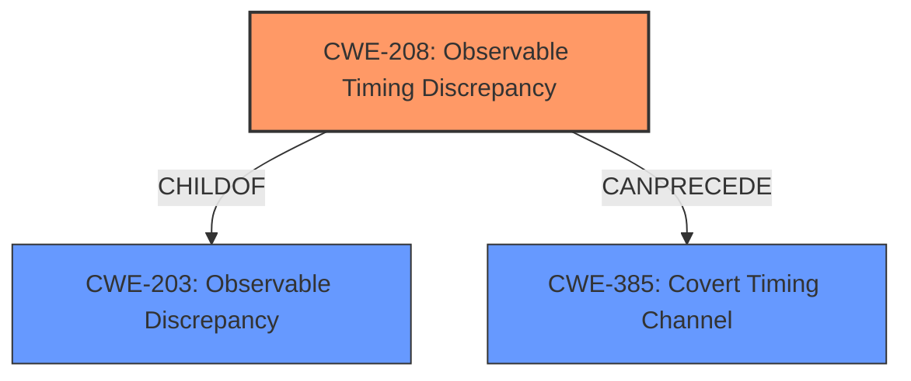

# Enhanced Analysis for CVE-2022-4823

# Summary
| CWE ID | CWE Name | Confidence | CWE Abstraction Level | CWE Vulnerability Mapping Label | CWE-Vulnerability Mapping Notes |
|---|---|---|---|---|---|
| CWE-208 | Observable Timing Discrepancy | 1.0 | Base | Allowed | Primary CWE |

## Evidence and Confidence

*   **Confidence Score:** 1.0
*   **Evidence Strength:** HIGH

## Relationship Analysis
The primary relationship that influenced the decision was the direct match of the vulnerability description to the definition of CWE-208. CWE-208 is a child of CWE-203 (Observable Discrepancy), indicating a more general form of observable differences. CWE-385 (Covert Timing Channel) can follow CWE-208, suggesting a potential exploitation path where timing differences are used to create a covert channel. Choosing CWE-208 provides the most specific and accurate classification in this case.



## Vulnerability Chain
The vulnerability chain starts with the **improper** comparison of signatures, leading to an **observable timing discrepancy**. This **weakness** allows an attacker to potentially bypass signature verification by timing the string comparison.

## Summary of Analysis
The initial analysis strongly suggests CWE-208 (Observable Timing Discrepancy) as the primary CWE. The vulnerability description explicitly mentions a "**timing discrepancy**" arising from the manipulation of the argument signature. The CVE Reference Links Content Summary further clarifies that the original implementation used a vulnerable method to compare signatures, susceptible to timing attacks. The code change replaces the insecure string comparison with `ActiveSupport::SecurityUtils.secure_compare` which performs a constant time comparison which prevents timing attacks.

The retriever results also support this assessment, with CWE-208 being the top-ranked CWE based on sparse analysis.

The evidence includes:

*   Vulnerability Description: "The manipulation of the argument signature leads to **observable timing discrepancy**."
*   CVE Reference Links Content Summary: "The original implementation used a potentially vulnerable method to compare the received signature with the calculated signature, which could be susceptible to timing attacks."
*   CVE Reference Links Content Summary: "**Timing Attack Vulnerability:** The original code used a simple string comparison (`signature != params[:Signature]`) which could potentially leak information about the correct signature via timing analysis."
*   CVE Reference Links Content Summary: "The vulnerability is mitigated by the code change which replaces the insecure string comparison with `ActiveSupport::SecurityUtils.secure_compare`. This method performs a constant time comparison which prevents timing attacks."

CWE-208 is at the Base level of abstraction, which is appropriate for mapping to the root cause of this vulnerability.

Other CWEs considered but not used:

*   CWE-79 (Improper Neutralization of Input During Web Page Generation ('Cross-site Scripting')): While this CWE is related to input handling, it does not directly address the core issue of timing discrepancies.
*   CWE-203 (Observable Discrepancy): This is a parent of CWE-208 and is more general. Since the vulnerability specifically involves timing, CWE-208 is a more precise fit.
*   CWE-89 (Improper Neutralization of Special Elements used in an SQL Command ('SQL Injection')): This CWE is not relevant as the vulnerability does not involve SQL commands.
*   CWE-93 (Improper Neutralization of CRLF Sequences ('CRLF Injection')): This CWE is not relevant as the vulnerability does not involve CRLF sequences.
*   CWE-113 (Improper Neutralization of CRLF Sequences in HTTP Headers ('HTTP Request/Response Splitting')): This CWE is not relevant as the vulnerability does not involve CRLF sequences in HTTP headers.
*   CWE-385 (Covert Timing Channel): While this CWE is related to timing, it describes a higher-level exploitation technique rather than the initial **weakness**.

The final decision to select CWE-208 is based on the specific evidence of a **timing discrepancy** and the alignment with the CWE's description and mapping guidance.


## CWE Relationship Analysis

Current CWEs represent these abstraction levels: .


### Vulnerability Chain Analysis

**Chain starting from CWE-89:**
- 89 (Improper Neutralization of Special Elements used in an SQL Command ('SQL Injection')) - ROOT


**Chain starting from CWE-208:**
- 208 (Observable Timing Discrepancy) - ROOT


### CWE Relationship Diagram

```mermaid
graph TD
    classDef primary fill:#f96,stroke:#333,stroke-width:2px
    classDef secondary fill:#69f,stroke:#333
    classDef tertiary fill:#9e9,stroke:#333
```