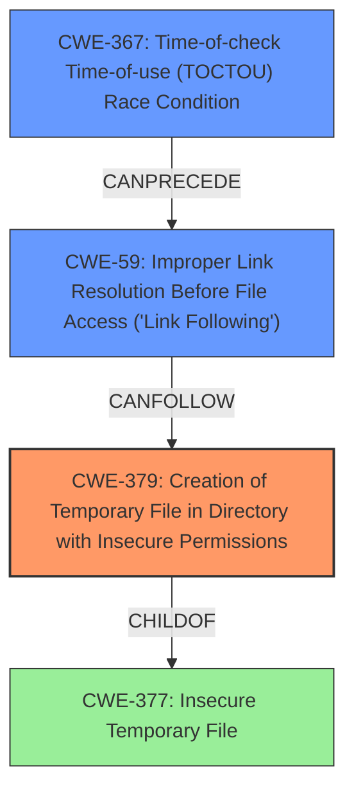

# Analysis Report for CVE-2022-48257

# Vulnerability Analysis Report: CVE-2022-48257

## Description


## Analysis (with Relationship Data)

# Summary
| CWE ID | CWE Name | Confidence | CWE Abstraction Level | CWE Vulnerability Mapping Label | CWE-Vulnerability Mapping Notes |
|---|---|---|---|---|---|
| CWE-379 | Creation of Temporary File in Directory with Insecure Permissions | 0.9 | Base | Allowed | Primary CWE |
| CWE-59 | Improper Link Resolution Before File Access ('Link Following') | 0.7 | Base | Allowed | Secondary Candidate |
| CWE-367 | Time-of-check Time-of-use (TOCTOU) Race Condition | 0.6 | Base | Allowed | Secondary Candidate |

## Evidence and Confidence

*   **Confidence Score:** 0.8
*   **Evidence Strength:** HIGH

## Relationship Analysis
The primary CWE is CWE-379, which deals with the creation of temporary files in directories with insecure permissions. CWE-59 (Improper Link Resolution) and CWE-367 (TOCTOU Race Condition) are related because predictable filenames and insecure directory permissions can allow attackers to exploit symlink following and race conditions. CWE-379 is a child of CWE-377 (Insecure Temporary File), a class-level weakness.



## Vulnerability Chain
The vulnerability chain starts with the creation of temporary files with **predictable names** in `/tmp` (a directory with insecure permissions), which then allows for potential symlink attacks and race conditions.
  - **Root Cause:** Creation of temporary files with predictable names and insecure permissions (CWE-379).
  - **Weakness 1:** Potential for symlink following due to predictable filenames (CWE-59).
  - **Weakness 2:** Potential for TOCTOU race conditions when creating/accessing the file (CWE-367).

## Summary of Analysis
The initial assessment identified several potential CWEs based on the vulnerability description and the retriever results. The primary concern is the insecure creation of log files with **predictable names** in a world-writable directory (`/tmp`). This directly relates to CWE-379 (Creation of Temporary File in Directory with Insecure Permissions).

The evidence supporting this includes:
-   "The root cause lies in the insecure creation of log files by both `etserver` and `etclient` in the `/tmp` directory."
-   "The filenames were predictable, generated using timestamps with only minute or second granularity, making them susceptible to various attacks."
-   "The files were created in a world-writable directory (`/tmp`)"

The retriever results also listed CWE-379 as a strong candidate. The CWE description matches the vulnerability details: "The product creates a temporary file in a directory whose permissions allow unintended actors to determine the file's existence or otherwise access that file." The advisory recommends placing logs in `/var/log/et` or `~/.et/`, further supporting the insecure location of `/tmp`.

CWE-59 (Improper Link Resolution Before File Access ('Link Following')) is a secondary concern. The **predictable filenames** and insecure permissions make the system vulnerable to symlink attacks. An attacker could create a symlink with the **predictable name** to a different file, potentially causing the program to operate on unintended files. The CVE Reference Links Content Summary mentions "Without kernel symlink protection, an attacker could potentially create files in privileged locations using symlink attacks."

CWE-367 (Time-of-check Time-of-use (TOCTOU) Race Condition) is another secondary concern. Since the files are created in a shared directory with **predictable names**, an attacker could potentially exploit a TOCTOU race condition by creating or modifying the file between the time the program checks for its existence and the time it uses it.

CWE-427 (Uncontrolled Search Path Element) was considered, as the `/tmp` directory might be part of a search path. However, the primary issue is the insecure creation of the log files themselves, not necessarily the search path used to find them. Therefore, CWE-427 is less relevant.

CWE-277 (Insecure Inherited Permissions) was considered but not selected because the core issue is the location and naming of the log files, rather than explicitly setting insecure permissions that are then inherited. While `/tmp` has insecure permissions, the primary weakness is the creation of the file in that location, covered by CWE-379.

The selected CWEs are at the optimal level of specificity. CWE-379 directly addresses the **root cause** of the vulnerability, while CWE-59 and CWE-367 highlight potential attack vectors that can be exploited due to the insecure file creation. These CWEs provide a comprehensive understanding of the vulnerability and its potential impact.


## CWE Relationship Analysis

Current CWEs represent these abstraction levels: .


### Vulnerability Chain Analysis

**Chain starting from CWE-277:**
- 277 (Insecure Inherited Permissions) - ROOT


**Chain starting from CWE-377:**
- 377 (Insecure Temporary File) - ROOT


### CWE Relationship Diagram

```mermaid
graph TD
    classDef primary fill:#f96,stroke:#333,stroke-width:2px
    classDef secondary fill:#69f,stroke:#333
    classDef tertiary fill:#9e9,stroke:#333
```


*Report generated on 2025-03-30 20:55:50*
