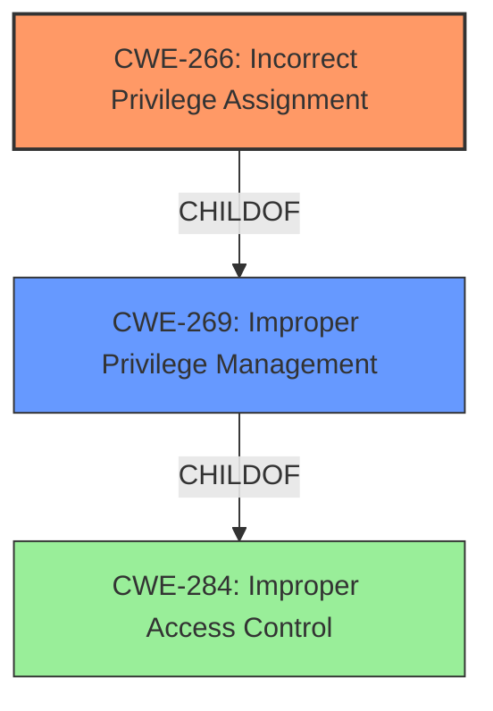

# Analysis for CVE-2022-48284

# Summary
| CWE ID | CWE Name | Confidence | CWE Abstraction Level | CWE Vulnerability Mapping Label | CWE-Vulnerability Mapping Notes |
|---|---|---|---|---|---|
| CWE-266 | Incorrect Privilege Assignment | 1.0 | Base | Allowed | Primary CWE |

## Evidence and Confidence

*   **Confidence Score:** 1.0
*   **Evidence Strength:** HIGH

## Relationship Analysis
The primary relationship that influenced the decision was the direct match between the vulnerability description's root cause (**Incorrect Privilege Assignment**) and the CWE name. CWE-266 is a child of CWE-269 (Improper Privilege Management), indicating a hierarchical relationship. However, CWE-266 is more specific and directly reflects the vulnerability. CWE-269 is a Class level CWE and is discouraged.

## Vulnerability Chain
The chain of root cause and weaknesses is as follows:
1.  **Root Cause:** **Incorrect Privilege Assignment** (CWE-266)
2.  **Impact:** Attackers gain access to restricted functions.

## Summary of Analysis
The analysis is heavily based on the provided evidence, particularly the "Vulnerability Description Key Phrases" and the "CVE Reference Links Content Summary". The vulnerability description explicitly states the root cause as "**Incorrect Privilege Assignment**". The CVE Reference confirms that the Huawei software "**does not correctly verify the caller's permission**," which leads to the incorrect privilege assignment. This direct match makes CWE-266 the most appropriate choice.

The retriever results also support this choice, with CWE-266 being the top-ranked CWE. While other CWEs like CWE-732 (Incorrect Permission Assignment for Critical Resource) and CWE-269 (Improper Privilege Management) were considered, they are either Class level CWEs or not as directly relevant as CWE-266. CWE-269 is too general and is discouraged, whereas CWE-266 is a Base level CWE and is allowed and preferred.

The selection of CWE-266 is at the optimal level of specificity because it precisely describes the **root cause** of the vulnerability: the incorrect assignment of privileges.