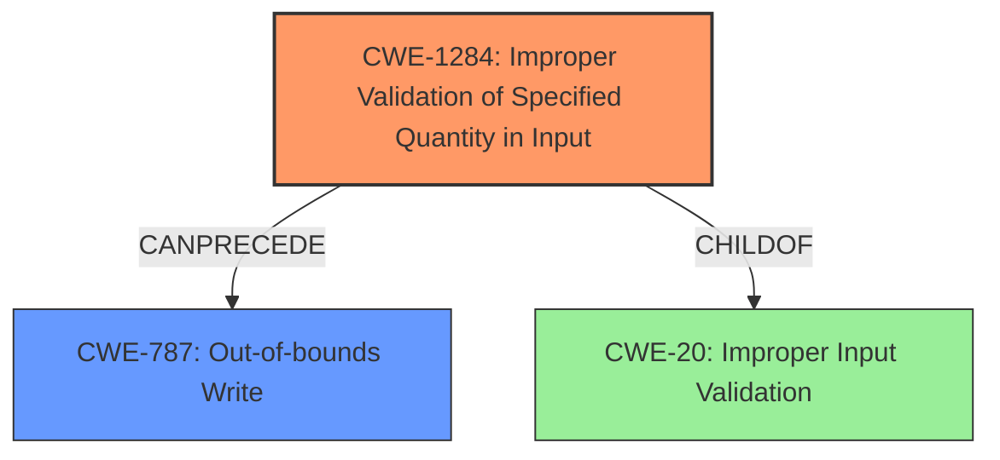

# Enhanced Analysis for CVE-2022-48297

# Summary
| CWE ID  | CWE Name                                                      | Confidence | CWE Abstraction Level | CWE Vulnerability Mapping Label | CWE-Vulnerability Mapping Notes |
| :-------- | :------------------------------------------------------------ | :--------- | :---------------------- | :------------------------------ | :------------------------------ |
| CWE-1284 | Improper Validation of Specified Quantity in Input       | 0.9        | Base                    | Primary                         | Allowed                       |
| CWE-787  | Out-of-bounds Write                                           | 0.7        | Base                    | Secondary                       | Allowed                       |

## Evidence and Confidence

*   **Confidence Score:** 0.8
*   **Evidence Strength:** HIGH

## Relationship Analysis
The primary CWE selected is CWE-1284, "Improper Validation of Specified Quantity in Input," which is directly related to the vulnerability description indicating a **failure to verify the length of input data**. CWE-787, "Out-of-bounds Write," is a consequence of this **lack of validation**, indicating a potential chain relationship where **improper validation can lead to out-of-bounds writes**. CWE-1284 is a child of CWE-20, "Improper Input Validation," further solidifying its role as a root cause.



## Vulnerability Chain
The vulnerability chain starts with the **root cause** of **not verifying the length of the input data** (CWE-1284). This leads directly to the impact of out-of-bounds memory access (CWE-787).

CWE-1284 (Improper Validation of Input Quantity) -> CWE-787 (Out-of-bounds Write)

## Summary of Analysis
The initial assessment strongly indicates that the **root cause** is the **lack of input validation**, specifically the **length of the input data** (CWE-1284). The resulting out-of-bounds write (CWE-787) is a direct consequence of this **missing validation**.

The evidence is strong. The "Vulnerability Description Key Phrases" section explicitly states the **root cause** as "**not verifying the length of the input data**." The "CVE Reference Links Content Summary" section further supports this by stating, "The geo-fencing kernel code does not verify the length of the input data." and the weaknesses are "Out-of-bounds memory access due to **lack of input data length validation**."

The selection of CWE-1284 as the primary CWE is justified by its direct match to the **root cause** described in the vulnerability. CWE-787 is selected as a secondary CWE because it represents the impact of the unvalidated input length leading to an out-of-bounds write. These CWEs are at the appropriate level of specificity, providing a clear and accurate representation of the vulnerability.

Relevant CWE Information:

# Enhanced Context (25 CWEs)

## CWE-1284: Improper Validation of Specified Quantity in Input
**Technical Explanation:** The geofencing kernel code **fails to validate the length of the input data**, which allows an attacker to provide crafted input data of improper length. This **lack of validation** can cause the application to process an incorrect amount of data, leading to out-of-bounds memory access.
**Security Implications:** This vulnerability allows an attacker to potentially write data outside the allocated buffer, leading to memory corruption, denial of service, or potentially arbitrary code execution.
**Relationship:** CWE-1284 is a child of CWE-20, "Improper Input Validation." It can precede CWE-787, "Out-of-bounds Write," when the **lack of validation** leads to writing beyond buffer boundaries.
**Mapping Guidance:** The usage is "Allowed." The rationale states that this CWE entry is at the Base level of abstraction, which is preferred for mapping to the **root causes** of vulnerabilities.
**Confidence:** 0.9

## CWE-787: Out-of-bounds Write
**Technical Explanation:** Due to the geofencing kernel code **not verifying the length of the input data**, a buffer can be written to past its boundaries. This occurs when the input data exceeds the buffer's allocated size, resulting in memory corruption.
**Security Implications:** Out-of-bounds writes can lead to arbitrary code execution, denial of service, or privilege escalation. The impact is severe, as it can allow attackers to gain control over the system.
**Relationship:** CWE-787 is a child of CWE-119, "Improper Restriction of Operations within the Bounds of a Memory Buffer." It is a direct consequence of improper input validation (CWE-20) and incorrect buffer size calculations (CWE-131).
**Mapping Guidance:** The usage is "Allowed." This is a Base level CWE.
**Confidence:** 0.7

## Other CWEs Considered:
CWE-190, CWE-131, CWE-125, CWE-805, CWE-130, CWE-193 were considered but not used because they do not directly address the **root cause** of **not verifying the length of input data** as clearly as CWE-1284. While some of these, such as CWE-131 (Incorrect Calculation of Buffer Size), could be related, the primary issue is the **lack of initial validation**, which CWE-1284 captures more accurately.


## CWE Relationship Analysis

Current CWEs represent these abstraction levels: .


### Vulnerability Chain Analysis

**Chain starting from CWE-131:**
- 131 (Incorrect Calculation of Buffer Size) - ROOT


**Chain starting from CWE-190:**
- 190 (Integer Overflow or Wraparound) - ROOT


### CWE Relationship Diagram

```mermaid
graph TD
    classDef primary fill:#f96,stroke:#333,stroke-width:2px
    classDef secondary fill:#69f,stroke:#333
    classDef tertiary fill:#9e9,stroke:#333
```