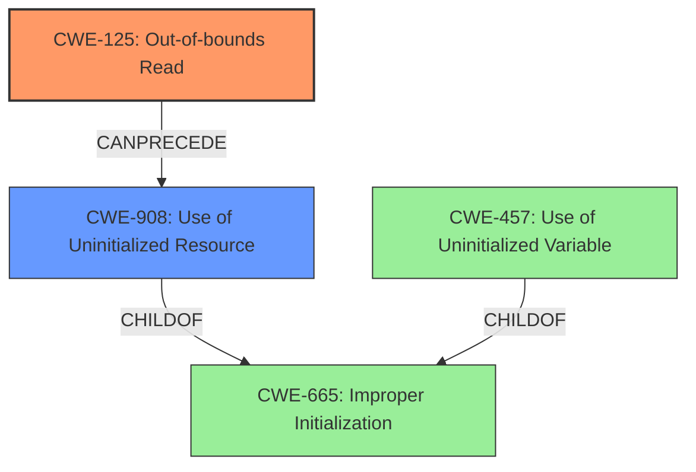

# Analysis for CVE-2022-48303

# Summary
| CWE ID  | CWE Name  | Confidence | CWE Abstraction Level | CWE Vulnerability Mapping Label | CWE-Vulnerability Mapping Notes |
|---|---|---|---|---|---|
| CWE-125 | Out-of-bounds Read | 1.0 | Base | Allowed | Primary CWE |
| CWE-908 | Use of Uninitialized Resource | 0.8 | Base | Allowed | Secondary Candidate |

## Evidence and Confidence

*   **Confidence Score:** 0.9
*   **Evidence Strength:** HIGH

## Relationship Analysis
The primary relationship influencing the decision is that CWE-125 is a direct consequence of an out-of-bounds read operation. Also, the **uninitialized memory** is read because of the **out-of-bounds read**. This could lead to using **uninitialized memory** which can then influence the flow of control.

## Vulnerability Chain
The vulnerability chain starts with an **out-of-bounds read** (CWE-125), which leads to the use of **uninitialized memory** (CWE-908), which then causes a change in the flow of control.

## Summary of Analysis
The analysis is based on the provided evidence, which clearly indicates an **out-of-bounds read** and subsequent use of **uninitialized memory**.

The description states: "GNU Tar through 1.34 has a one-byte **out-of-bounds read** that results in use of **uninitialized memory** for a conditional jump."

The graph relationships show how an out-of-bounds read can precede the use of uninitialized memory. CWE-125 is the primary weakness because it is the root cause, while CWE-908 is a secondary weakness that arises as a consequence.

CWE-125 and CWE-908 are at the optimal level of specificity because they directly describe the weakness in the vulnerability description.

Relevant CWE Information:

# Enhanced Context (25 CWEs)
The following CWEs were identified as potentially relevant to this vulnerability:

## CWE-824: Access of Uninitialized Pointer
**Abstraction Level**: Base
**Similarity Score**: 0.74
**Source**: dense

**Description**:
The product accesses or uses a pointer that has not been initialized.

**Mapping Guidance**:
- Usage: Allowed
- Rationale: This CWE entry is at the Base level of abstraction, which is a preferred level of abstraction for mapping to the root causes of vulnerabilities.

## CWE-131: Incorrect Calculation of Buffer Size
**Abstraction Level**: Base
**Similarity Score**: 0.74
**Source**: dense

**Description**:
The product does not correctly calculate the size to be used when allocating a buffer, which could lead to a buffer overflow.

**Mapping Guidance**:
- Usage: Allowed
- Rationale: This CWE entry is at the Base level of abstraction, which is a preferred level of abstraction for mapping to the root causes of vulnerabilities.

## CWE-125: Out-of-bounds Read
**Abstraction Level**: Base
**Similarity Score**: 0.73
**Source**: dense

**Description**:
The product reads data past the end, or before the beginning, of the intended buffer.

**Mapping Guidance**:
- Usage: Allowed
- Rationale: This CWE entry is at the Base level of abstraction, which is a preferred level of abstraction for mapping to the root causes of vulnerabilities.

## CWE-193: Off-by-one Error
**Abstraction Level**: Base
**Similarity Score**: 0.73
**Source**: dense

**Description**:
A product calculates or uses an incorrect maximum or minimum value that is 1 more, or 1 less, than the correct value.

**Mapping Guidance**:
- Usage: Allowed
- Rationale: This CWE entry is at the Base level of abstraction, which is a preferred level of abstraction for mapping to the root causes of vulnerabilities.

## CWE-252: Unchecked Return Value
**Abstraction Level**: Base
**Similarity Score**: 0.73
**Source**: dense

**Description**:
The product does not check the return value from a method or function, which can prevent it from detecting unexpected states and conditions.

**Mapping Guidance**:
- Usage: Allowed
- Rationale: This CWE entry is at the Base level of abstraction, which is a preferred level of abstraction for mapping to the root causes of vulnerabilities.

## CWE-129: Improper Validation of Array Index
**Abstraction Level**: Variant
**Similarity Score**: 0.73
**Source**: dense

**Description**:
The product uses untrusted input when calculating or using an array index, but the product does not validate or incorrectly validates the index to ensure the index references a valid position within the array.

**Mapping Guidance**:
- Usage: Allowed
- Rationale: This CWE entry is at the Variant level of abstraction, which is a preferred level of abstraction for mapping to the root causes of vulnerabilities.

## CWE-754: Improper Check for Unusual or Exceptional Conditions
**Abstraction Level**: Class
**Similarity Score**: 0.72
**Source**: dense

**Description**:
The product does not check or incorrectly checks for unusual or exceptional conditions that are not expected to occur frequently during day to day operation of the product.

**Mapping Guidance**:
- Usage: Allowed-with-Review
- Rationale: This CWE entry is a Class and might have Base-level children that would be more appropriate

## CWE-703: Improper Check or Handling of Exceptional Conditions
**Abstraction Level**: Pillar
**Similarity Score**: 0.72
**Source**: dense

**Description**:
The product does not properly anticipate or handle exceptional conditions that rarely occur during normal operation of the product.

**Mapping Guidance**:
- Usage: Discouraged
- Rationale: This CWE entry is extremely high-level, a Pillar.

## CWE-665: Improper Initialization
**Abstraction Level**: Class
**Similarity Score**: 0.72
**Source**: dense

**Description**:
The product does not initialize or incorrectly initializes a resource, which might leave the resource in an unexpected state when it is accessed or used.

**Mapping Guidance**:
- Usage: Discouraged
- Rationale: This CWE entry is a level-1 Class (i.e., a child of a Pillar). It might have lower-level children that would be more appropriate

## CWE-407: Inefficient Algorithmic Complexity
**Abstraction Level**: Class
**Similarity Score**: 0.72
**Source**: dense

**Description**:
An algorithm in a product has an inefficient worst-case computational complexity that may be detrimental to system performance and can be triggered by an attacker, typically using crafted manipulations that ensure that the worst case is being reached.

**Mapping Guidance**:
- Usage: Allowed-with-Review
- Rationale: This CWE entry is a Class and might have Base-level children that would be more appropriate

## CWE-125: Out-of-bounds Read
**Abstraction Level**: Base
**Similarity Score**: 2478.98
**Source**: sparse

**Description**:
The product reads data past the end, or before the beginning, of the intended buffer.

**Mapping Guidance**:
- Usage: Allowed
- Rationale: This CWE entry is at the Base level of abstraction, which is a preferred level of abstraction for mapping to the root causes of vulnerabilities.

## CWE-1284: Improper Validation of Specified Quantity in Input
**Abstraction Level**: Base
**Similarity Score**: 2401.58
**Source**: sparse

**Description**:
The product receives input that is expected to specify a quantity (such as size or length), but it does not validate or incorrectly validates that the quantity has the required properties.

**Mapping Guidance**:
- Usage: Allowed
- Rationale: This CWE entry is at the Base level of abstraction, which is a preferred level of abstraction for mapping to the root causes of vulnerabilities.

## CWE-193: Off-by-one Error
**Abstraction Level**: Base
**Similarity Score**: 2383.61
**Source**: sparse

**Description**:
A product calculates or uses an incorrect maximum or minimum value that is 1 more, or 1 less, than the correct value.

**Mapping Guidance**:
- Usage: Allowed
- Rationale: This CWE entry is at the Base level of

# Enhanced Query for CVE-2022-48303

# Vulnerability Description

    GNU Tar through 1.34 has a one-byte **out-of-bounds read** that results in use of **uninitialized memory** for a conditional jump. Exploitation to change the flow of control has not been demonstrated. The issue occurs in from_header in list.c via a V7 archive in which mtime has approximately 11 whitespace characters.

    # Keyphrase-Specific CWE Analysis
    This vulnerability contains multiple keyphrases that may map to different CWEs. 
    Please analyze each keyphrase separately and determine the most appropriate CWE(s) for each.

    ## WEAKNESS: 'out-of-bounds read'

Relevant CWEs for this WEAKNESS:

### 1. CWE-125: Out-of-bounds Read (Score: 427.63)

The product reads data past the end, or before the beginning, of the intended buffer....

### 2. CWE-193: Off-by-one Error (Score: 353.50)

A product calculates or uses an incorrect maximum or minimum value that is 1 more, or 1 less, than the correct value....

### 3. CWE-908: Use of Uninitialized Resource (Score: 337.45)

The product uses or accesses a resource that has not been initialized....

### 4. CWE-122: Heap-based Buffer Overflow (Score: 325.48)

A heap overflow condition is a buffer overflow, where the buffer that can be overwritten is allocated in the heap portion of memory, generally meaning that the buffer was allocated using a routine such as malloc()....

### 5. CWE-119: Improper Restriction of Operations within the Bounds of a Memory Buffer (Score: 325.08)

The product performs operations on a memory buffer, but it reads from or writes to a memory location outside the buffer's intended boundary. This may result in read or write operations on unexpected memory locations that could be linked to other variables, data structures, or internal program data....

## WEAKNESS: 'uninitialized memory'

Relevant CWEs for this WEAKNESS:

### 1. CWE-125: Out-of-bounds Read (Score: 427.63)

The product reads data past the end, or before the beginning, of the intended buffer....

### 2. CWE-908: Use of Uninitialized Resource (Score: 337.45)

The product uses or accesses a resource that has not been initialized....

### 3. CWE-909: Missing Initialization of Resource (Score: 333.32)

The product does not initialize a critical resource....

### 4. CWE-457: Use of Uninitialized Variable (Score: 310.15)

The code uses a variable that has not been initialized, leading to unpredictable or unintended results....

### 5. CWE-665: Improper Initialization (Score: 306.13)

The product does not initialize or incorrectly initializes a resource, which might leave the resource in an unexpected state when it is accessed or used....

## IMPACT: 'change the flow of control'

Relevant CWEs for this IMPACT:

### 1. CWE-125: Out-of-bounds Read (Score: 427.63)

The product reads data past the end, or before the beginning, of the intended buffer....

### 2. CWE-193: Off-by-one Error (Score: 353.50)

A product calculates or uses an incorrect maximum or minimum value that is 1 more, or 1 less, than the correct value....

### 3. CWE-909: Missing Initialization of Resource (Score: 333.32)

The product does not initialize a critical resource....

### 4. CWE-122: Heap-based Buffer Overflow (Score: 325.48)

A heap overflow condition is a buffer overflow, where the buffer that can be overwritten is allocated in the heap portion of memory, generally meaning that the buffer was allocated using a routine such as malloc()....

### 5. CWE-1284: Improper Validation of Specified Quantity in Input (Score: 110.59)

The product receives input that is expected to specify a quantity (such as size or length), but it does not validate or incorrectly validates that the quantity has the required properties....

## VECTOR: 'V7 archive in which mtime has approximately 11 whitespace characters'

Relevant CWEs for this VECTOR:

### 1. CWE-125: Out-of-bounds Read (Score: 427.63)

The product reads data past the end, or before the beginning, of the intended buffer....

### 2. CWE-909: Missing Initialization of Resource (Score: 333.32)

The product does not initialize a critical resource....

### 3. CWE-119: Improper Restriction of Operations within the Bounds of a Memory Buffer (Score: 325.08)

The product performs operations on a memory buffer, but it reads from or writes to a memory location outside the buffer's intended boundary. This may result in read or write operations on unexpected memory locations that could be linked to other variables, data structures, or internal program data....

### 4. CWE-156: Improper Neutralization of Whitespace (Score: 124.42)

The product receives input from an upstream component, but it does not neutralize or incorrectly neutralizes special elements that could be interpreted as whitespace when they are sent to a downstream component....

### 5. CWE-1284: Improper Validation of Specified Quantity in Input (Score: 110.59)

The product receives input that is expected to specify a quantity (such as size or length), but it does not validate or incorrectly validates that the quantity has the required properties....

## PRODUCT: 'GNU Tar'

Relevant CWEs for this PRODUCT:

### 1. CWE-125: Out-of-bounds Read (Score: 427.63)

The product reads data past the end, or before the beginning, of the intended buffer....

### 2. CWE-193: Off-by-one Error (Score: 353.50)

A product calculates or uses an incorrect maximum or minimum value that is 1 more, or 1 less, than the correct value....

### 3. CWE-909: Missing Initialization of Resource (Score: 333.32)

The product does not initialize a critical resource....

### 4. CWE-122: Heap-based Buffer Overflow (Score: 325.48)

A heap overflow condition is a buffer overflow, where the buffer that can be overwritten is allocated in the heap portion of memory, generally meaning that the buffer was allocated using a routine such as malloc()....

### 5. CWE-59: Improper Link Resolution Before File Access ('Link Following') (Score: 100.64)

The product attempts to access a file based on the filename, but it does not properly prevent that filename from identifying a link or shortcut that resolves to an unintended resource....

## VERSION: 'through 1.34'

Relevant CWEs for this VERSION:

### 1. CWE-125: Out-of-bounds Read (Score: 427.63)

The product reads data past the end, or before the beginning, of the intended buffer....

### 2. CWE-193: Off-by-one Error (Score: 353.50)

A product calculates or uses an incorrect maximum or minimum value that is 1 more, or 1 less, than the correct value....

### 3. CWE-909: Missing Initialization of Resource (Score: 333.32)

The product does not initialize a critical resource....

### 4. CWE-1284: Improper Validation of Specified Quantity in Input (Score: 110.59)

The product receives input that is expected to specify a quantity (such as size or length), but it does not validate or incorrectly validates that the quantity has the required properties....

### 5. CWE-170: Improper Null Termination (Score: 100.32)

The product does not terminate or incorrectly terminates a string or array with a null character or equivalent terminator....

## COMPONENT: 'from_header in list.c'

Relevant CWEs for this COMPONENT:

### 1. CWE-125: Out-of-bounds Read (Score: 427.63)

The product reads data past the end, or before the beginning, of the intended buffer....

### 2. CWE-193: Off-by-one Error (Score: 353.50)

A product calculates or uses an incorrect maximum or minimum value that is 1 more, or 1 less, than the correct value....

### 3. CWE-909: Missing Initialization of Resource (Score: 333.32)

The product does not initialize a critical resource....

### 4. CWE-122: Heap-based Buffer Overflow (Score: 325.48)

A heap overflow condition is a buffer overflow, where the buffer that can be overwritten is allocated in the heap portion of memory, generally meaning that the buffer was allocated using a routine such as malloc()....

### 5. CWE-476: NULL Pointer Dereference (Score: 111.42)

The product dereferences a pointer that it expects to be valid but is NULL....

    # Analysis Instructions
    1. For each keyphrase, identify the most appropriate CWE(s) that represent the weakness.
    2. Consider how the different keyphrases might relate to each other in the vulnerability chain.
    3. Provide a final determination of primary CWE(s) and any secondary CWEs.
    4. Format your response using the standard analysis template.

    Please analyze how these different weaknesses interact and provide a comprehensive CWE classification.
    