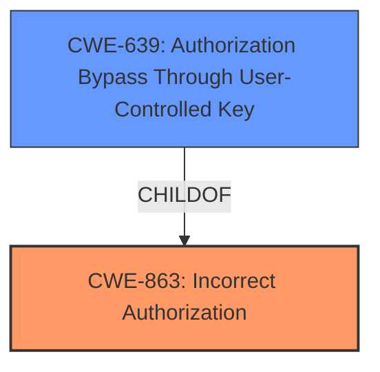

# Raw Analyzer Response for CVE-2022-48367

# Summary
| CWE ID | CWE Name | Confidence | CWE Abstraction Level | CWE Vulnerability Mapping Label | CWE-Vulnerability Mapping Notes |
|---|---|---|---|---|---|
| CWE-863 | Incorrect Authorization | 0.9 | Class | Allowed-with-Review | Primary CWE |
| CWE-639 | Authorization Bypass Through User-Controlled Key | 0.7 | Base | Allowed | Secondary CWE |

## Evidence and Confidence

*   **Confidence Score:** 0.8
*   **Evidence Strength:** MEDIUM

## Relationship Analysis
The primary CWE is CWE-863 **Incorrect Authorization**, which is a Class-level CWE. CWE-639 **Authorization Bypass Through User-Controlled Key** is a Base-level CWE and a ChildOf CWE-863. Because the vulnerability description indicates a **mishandling of access control based on object state**, it is likely that an authorization bypass is occurring. The relationship between CWE-863 and CWE-639 is important because it shows that the authorization bypass could be happening due to a user-controlled key.

## Vulnerability Chain
The vulnerability chain starts with the **mishandling of access control based on object state**, which leads to **Incorrect Authorization** (CWE-863), and potentially an **Authorization Bypass Through User-Controlled Key** (CWE-639).

## Summary of Analysis
The initial analysis pointed towards CWE-863 **Incorrect Authorization** due to the **mishandling of access control based on object state**.
The retriever results also suggest CWE-639 **Authorization Bypass Through User-Controlled Key** as a potential match.
The description of **"Ineffective object state limitation"** and the fact that "**the vulnerability allowed access regardless of the state**" indicates that the authorization check is not correctly performed.

I am choosing CWE-863 as the primary CWE because it is a more general description of the vulnerability, and CWE-639 as a secondary CWE because it is a more specific description of how the authorization bypass could be happening. Both CWEs are at the appropriate level of specificity for this vulnerability.
The evidence supporting this decision comes from the "**Vulnerability Description Key Phrases**" section, which mentions "**mishandling of access control based on object state**," and the "**CVE Reference Links Content Summary**" section, which describes the "**Ineffective object state limitation**".

Relevant CWE Information:

# Enhanced Context (25 CWEs)

## CWE-639: Authorization Bypass Through User-Controlled Key
**Abstraction:** Base
**Status:** Incomplete

### Description
The system's authorization functionality does not prevent one user from gaining access to another user's data or record by modifying the key value identifying the data.

### Extended Description

Retrieval of a user record occurs in the system based on some key value that is under user control. The key would typically identify a user-related record stored in the system and would be used to lookup that record for presentation to the user. It is likely that an attacker would have to be an authenticated user in the system. However, the authorization process would not properly check the data access operation to ensure that the authenticated user performing the operation has sufficient entitlements to perform the requested data access, hence bypassing any other authorization checks present in the system.

### Mapping Guidance
**Usage:** Allowed
**Rationale:** This CWE entry is at the Base level of abstraction, which is a preferred level of abstraction for mapping to the root causes of vulnerabilities.

## CWE-863: Incorrect Authorization
**Abstraction:** Class
**Status:** Incomplete

### Description
The product performs an authorization check when an actor attempts to access a resource or perform an action, but it does not correctly perform the check.

### Extended Description
Not provided

### Mapping Guidance
**Usage:** Allowed-with-Review
**Rationale:** This CWE entry is a Class and might have Base-level children that would be more appropriate
**Comments:** Examine children of this entry to see if there is a better fit
**Reasons:**
- Abstraction