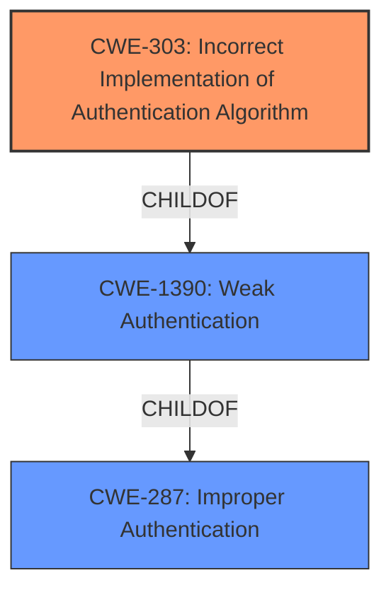

# Raw Analyzer Response for CVE-2022-4861

# Summary
| CWE ID | CWE Name | Confidence | CWE Abstraction Level | CWE Vulnerability Mapping Label | CWE-Vulnerability Mapping Notes |
|---|---|---|---|---|---|
| CWE-303 | Incorrect Implementation of Authentication Algorithm | 1.0 | Base | Primary | Allowed |
| CWE-287 | Improper Authentication | 0.5 | Class | Secondary | Discouraged |
| CWE-1390 | Weak Authentication | 0.4 | Class | Secondary | Allowed-with-Review |

## Evidence and Confidence

*   **Confidence Score:** 0.8
*   **Evidence Strength:** HIGH

## Relationship Analysis
The primary CWE selected, CWE-303, is a child of CWE-1390 (Weak Authentication), which in turn is a child of CWE-287 (Improper Authentication). While CWE-303 is the most specific and accurate representation of the vulnerability's root cause, understanding its relationship to the broader categories of authentication failures helps provide context. The abstraction levels influenced the decision to choose the base level CWE-303.

## Vulnerability Chain
The vulnerability chain starts with an **incorrect implementation of an authentication protocol** (CWE-303). This leads to the ability for a high-privileged user to **get other users tokens to another resource**, resulting in unauthorized access and potential information disclosure.

## Summary of Analysis
The initial assessment identified **Incorrect implementation in authentication protocol** as the root cause, which strongly suggested CWE-303. The CVE Reference Links Content Summary explicitly mentions this CWE.

The retriever results also list CWE-303 as the top candidate.

Given the direct evidence and the retriever results, CWE-303 is the most appropriate and specific choice.

CWE-287 and CWE-1390 were considered but not chosen as the primary CWE because they are broader and less descriptive of the specific **incorrect implementation** issue. While related, they represent higher-level classifications that do not capture the nuance of the vulnerability. CWE-668 was also considered, but it focuses on the exposure of resources to the wrong sphere, which is a consequence of the authentication failure rather than the root cause.

Relevant CWE Information:

# Enhanced Context (25 CWEs)

## CWE-303: Incorrect Implementation of Authentication Algorithm
**Abstraction Level**: Base
**Similarity Score**: 0.81
**Source**: dense

**Description**:
The requirements for the product dictate the use of an established authentication algorithm, but the implementation of the algorithm is incorrect.

**Mapping Guidance**:
- Usage: Allowed
- Rationale: This CWE entry is at the Base level of abstraction, which is a preferred level of abstraction for mapping to the root causes of vulnerabilities.

## CWE-287: Improper Authentication
**Abstraction Level**: Class
**Similarity Score**: 4673.42
**Source**: sparse

**Description**:
When an actor claims to have a given identity, the product does not prove or insufficiently proves that the claim is correct.

**Mapping Guidance**:
- Usage: Discouraged
- Rationale: This CWE entry might be misused when lower-level CWE entries are likely to be applicable. It is a level-1 Class (i.e., a child of a Pillar).

## CWE-1390: Weak Authentication
**Abstraction Level**: Class
**Similarity Score**: 4765.58
**Source**: sparse

**Description**:
The product uses an authentication mechanism to restrict access to specific users or identities, but the mechanism does not sufficiently prove that the claimed identity is correct.

**Mapping Guidance**:
- Usage: Allowed-with-Review
- Rationale: This CWE entry is a Class and might have Base-level children that would be more appropriate