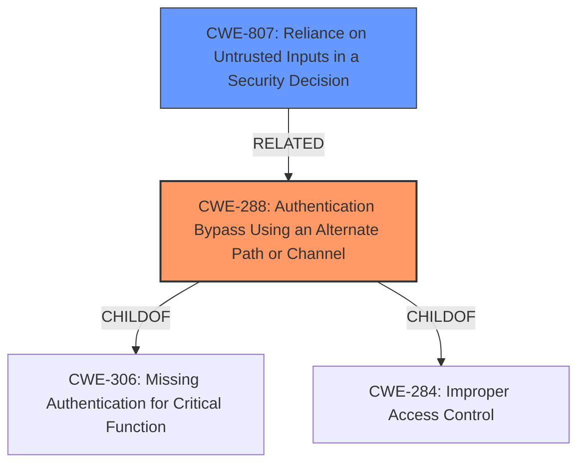

# Enhanced Analysis for CVE-2022-4874

# Summary
| CWE ID | CWE Name | Confidence | CWE Abstraction Level | CWE Vulnerability Mapping Label | CWE-Vulnerability Mapping Notes |
|---|---|---|---|---|---|
| CWE-288 | Authentication Bypass Using an Alternate Path or Channel | 0.9 | Base | Allowed | Primary CWE. The vulnerability bypasses authentication by using an alternate path that doesn't require authentication. |
| CWE-807 | Reliance on Untrusted Inputs in a Security Decision | 0.7 | Base | Allowed | Secondary CWE. The vulnerability relies on the existence of specific characters in the URL, which can be manipulated by an attacker. |

## Evidence and Confidence

*   **Confidence Score:** 0.8
*   **Evidence Strength:** HIGH

## Relationship Analysis
The primary CWE is CWE-288, which is a base-level CWE. It accurately describes the vulnerability where authentication is bypassed using an alternate path. CWE-288 is a child of CWE-306 (Missing Authentication for Critical Function) and CWE-284 (Improper Access Control). CWE-807 (Reliance on Untrusted Inputs in a Security Decision) is a related weakness, as the application relies on untrusted input (the URL) for making security decisions.



## Vulnerability Chain
The vulnerability chain starts with **improper input validation** (using `strstr()` instead of properly validating the file extension). This leads to an **authentication bypass**, allowing an unauthenticated user to access content. The root cause is the **flawed authentication bypass** implemented in the `httpd` service.

## Summary of Analysis
The initial assessment correctly identified CWE-288 as the primary weakness, given the **authentication bypass** achieved through a flawed path check. The "CVE Reference Links Content Summary" section specifically states: "The vulnerability stems from a **flawed authentication bypass** implemented in the `httpd` service. The service uses the `strstr()` function to check for specific file extensions (`.css`, `.png`, etc.) within the request path, instead of properly validating the file extension at the end of the path. This allows an attacker to bypass authentication by prefixing the requested path with a string containing a valid extension pattern such as `/.css/`." This supports the selection of CWE-288 (Authentication Bypass Using an Alternate Path or Channel) because the application has an alternate path that does not require authentication.

CWE-807 is included as a secondary weakness. This is because the application relies on the existence of specific characters in the URL (`.css`, `.png`, etc.) for its authentication logic, making it vulnerable to manipulation by untrusted actors.

CWE-306 (Missing Authentication for Critical Function) and CWE-287 (Improper Authentication) were considered but deemed less appropriate. While authentication is clearly bypassed, CWE-288 provides a more precise description of *how* the bypass occurs (alternate path). CWE-287 is discouraged by MITRE, and CWE-306 isn't specific enough.

The selected CWEs are at the optimal level of specificity because CWE-288 (Authentication Bypass Using an Alternate Path or Channel) is a base-level CWE that accurately reflects the vulnerability, and CWE-807 (Reliance on Untrusted Inputs in a Security Decision) highlights the reliance on vulnerable inputs for authentication.


## CWE Relationship Analysis

Current CWEs represent these abstraction levels: .


### Vulnerability Chain Analysis

**Chain starting from CWE-807:**
- 807 (Reliance on Untrusted Inputs in a Security Decision) - ROOT


**Chain starting from CWE-287:**
- 287 (Improper Authentication) - ROOT


### CWE Relationship Diagram

```mermaid
graph TD
    classDef primary fill:#f96,stroke:#333,stroke-width:2px
    classDef secondary fill:#69f,stroke:#333
    classDef tertiary fill:#9e9,stroke:#333
```