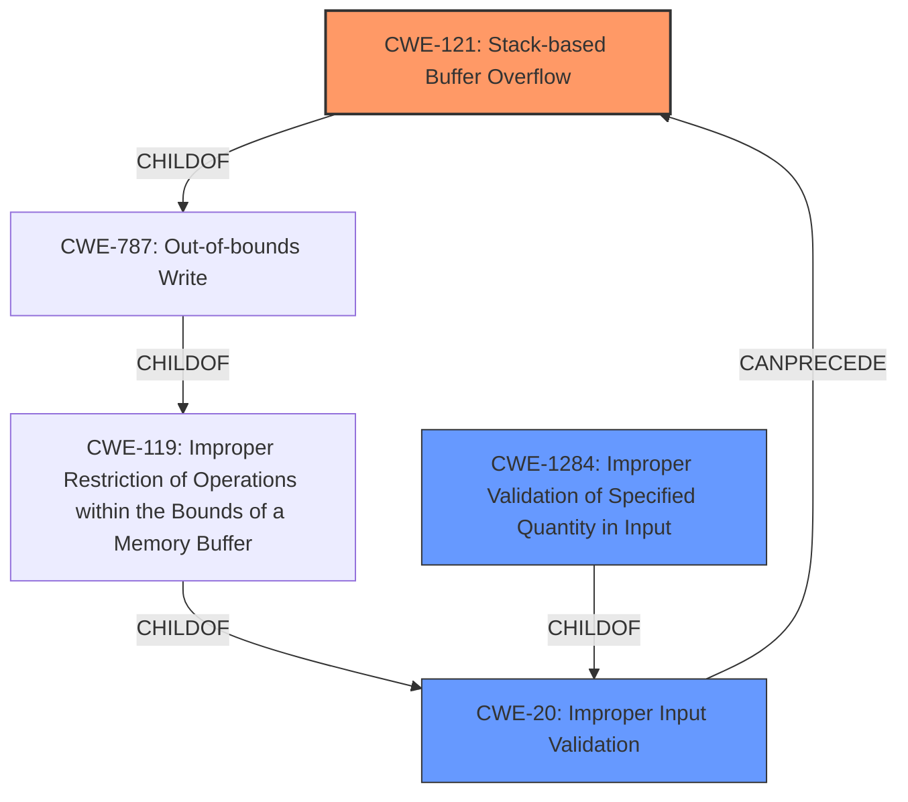

# Analysis Report for CVE-2022-4904

# Vulnerability Analysis Report: CVE-2022-4904

## Description


## Analysis (with Relationship Data)

# Summary
| CWE ID | CWE Name | Confidence | CWE Abstraction Level | CWE Vulnerability Mapping Label | CWE-Vulnerability Mapping Notes |
|---|---|---|---|---|---|
| CWE-121 | Stack-based Buffer Overflow | 1.0 | Variant | Allowed | Primary CWE |
| CWE-20 | Improper Input Validation | 0.7 | Class | Discouraged | Secondary Candidate |
| CWE-1284 | Improper Validation of Specified Quantity in Input | 0.6 | Base | Allowed | Secondary Candidate |

## Evidence and Confidence

*   **Confidence Score:** 0.9
*   **Evidence Strength:** HIGH

## Relationship Analysis
The primary weakness is a stack-based buffer overflow (CWE-121), which is a variant of CWE-787 (Out-of-bounds Write) and CWE-119 (Improper Restriction of Operations within the Bounds of a Memory Buffer). The root cause is **missing input validation**, which can be represented by CWE-20 (Improper Input Validation). A more specific type of input validation issue is the improper validation of specified quantity (CWE-1284). The chain of events is **missing input validation** leading to a stack-based buffer overflow.



## Vulnerability Chain
The vulnerability chain is:
1.  **Missing Input Validation (CWE-20)**: The `ares_set_sortlist` function does not properly validate the length of the input string.
2.  **Stack-based Buffer Overflow (CWE-121)**: The lack of validation allows an arbitrary length string to be copied to a stack buffer, leading to a buffer overflow.
3.  Impact: Denial of service or limited impact on confidentiality and integrity.

## Summary of Analysis
The primary CWE is CWE-121 (Stack-based Buffer Overflow) because the vulnerability description clearly states that the **missing checks** in the `ares_set_sortlist` function lead to a possible arbitrary length **stack overflow**. This is directly supported by the CVE Reference Links Content Summary, which states "The `ares_set_sortlist` function does not validate the length of the input string before using it in `config_sortlist`...leading to a potential buffer overflow on the stack." CWE-121 is a Variant, which is the preferred level of abstraction.

CWE-20 (Improper Input Validation) is a secondary candidate because the root cause of the vulnerability is **missing input validation**. However, CWE-20 is a Class, and the description suggests using more specific children if possible. The CVE Reference Links Content Summary also has CWE-20 listed.

CWE-1284 (Improper Validation of Specified Quantity in Input) is another secondary candidate as a more specific form of input validation. The input string length is not validated.

The final selection of CWE-121 as the primary weakness, with CWE-20 and CWE-1284 as contributing factors, reflects the specific details of the vulnerability and adheres to the principle of selecting the most specific CWE available while acknowledging the role of input validation in preventing the overflow.

Relevant CWE Information:
- CWE-121: Stack-based Buffer Overflow - This is the most direct description of the **weakness**.
- CWE-20: Improper Input Validation - This captures the **rootcause** of the vulnerability: the **missing input validation**.
- CWE-1284: Improper Validation of Specified Quantity in Input - This captures the **rootcause** of the vulnerability: the **missing input validation** of the length.

The other CWEs were considered but deemed less relevant because they did not directly address the specific vulnerability. For example, CWE-190 (Integer Overflow or Wraparound) was considered because integer overflows can lead to buffer overflows, but there's no direct evidence of an integer overflow in the provided description. Similarly, CWE-125 (Out-of-bounds Read) wasn't selected because the description focuses on a write (overflow) rather than a read.


## CWE Relationship Analysis

Current CWEs represent these abstraction levels: .


### Vulnerability Chain Analysis

**Chain starting from CWE-190:**
- 190 (Integer Overflow or Wraparound) - ROOT


**Chain starting from CWE-20:**
- 20 (Improper Input Validation) - ROOT


### CWE Relationship Diagram

```mermaid
graph TD
    classDef primary fill:#f96,stroke:#333,stroke-width:2px
    classDef secondary fill:#69f,stroke:#333
    classDef tertiary fill:#9e9,stroke:#333
```


*Report generated on 2025-03-30 21:24:54*
